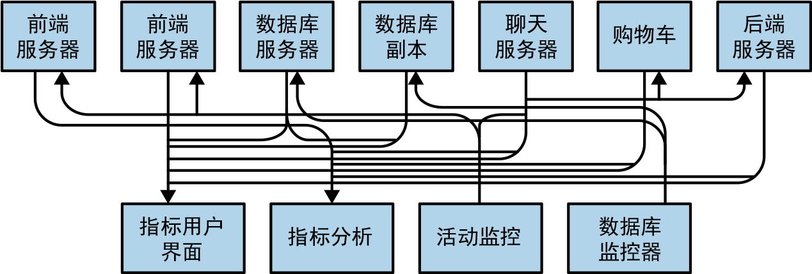
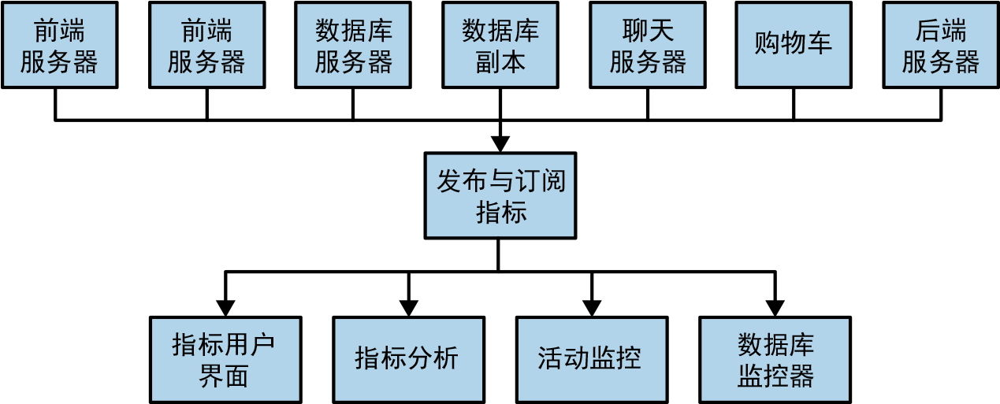
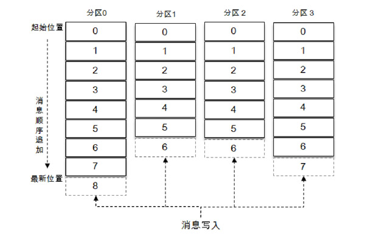
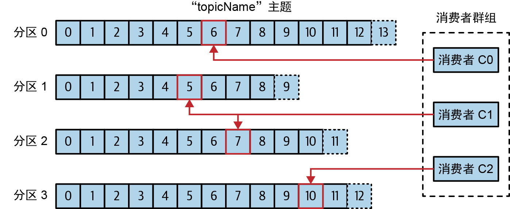
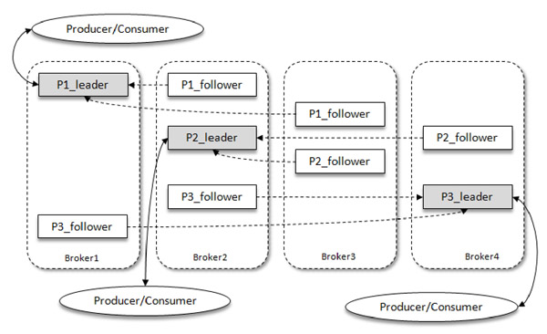
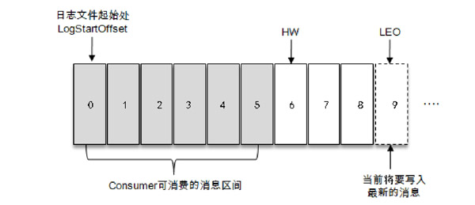
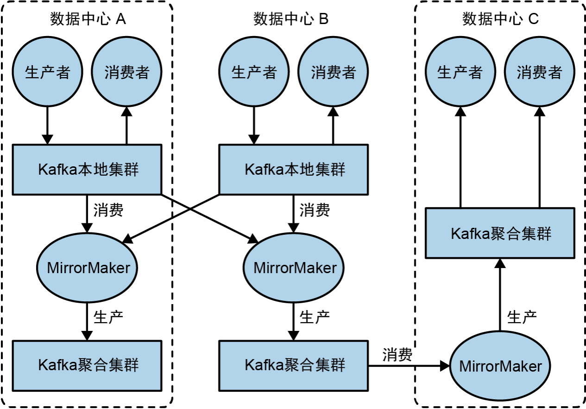
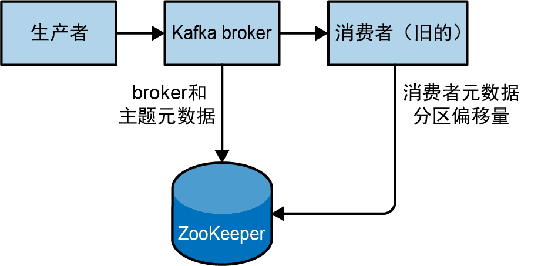

# 基本概念

>书籍：Kafka: The Definitive Guide
>
>Kafka 文档：https://developer.confluent.io/

Kafka 的设计理念是将数据视为持续演变和不断增长的流，而不是像关系型数据库那样侧重于静态存储数据。它是一个「分布式流式处理」平台，能够发布/订阅/存储/处理数据流，可以将其认为是 real-time 版本的 Hadoop，与传统消息系统存在以下差异：

1. 作为现代分布式集群，可以弹性扩展以处理各个业务的数据流
2. 作为数据连接层，为数据传递提供了可复制、可持久化的语义 
3. 基于流式处理，可以动态地处理（窗口、连接、变换和聚合）派生数据流和数据集


应用场景：

1. **异步处理**：生产者将消息写入 Kafka 后直接返回，无需等待消费者实时处理完毕。可缩短接口响应时间、提升系统吞吐量

2. **应用解耦**：Kafka 作为生产者和消费者之间的消息中间层，将「直接调用」转变为「基于契约的间接通信」，使得双方以最小代价独立演化

3. **流量削锋**：缓冲瞬时大量请求，后端按自身能力平稳消费

4. **日志处理**：收集分布式应用产生的海量日志并集中存储

## 基本术语

### 发布与订阅

**发布/订阅模式**（Pub/Sub）是一种消息传递范式，其特点是发送者（发布者）与接收者（订阅者）不直接通信。它们通过一个中间层（消息代理或事件总线）进行解耦，使得发布者仅需了解中间层的接口即可，并直接向其发送消息，而无需关注接收者的具体细节。这种模式有着极高的扩展性。

|                           直接连接                           |                          发布/订阅                           |
| :----------------------------------------------------------: | :----------------------------------------------------------: |
|  |  |

Kafka 的核心功能就是发布与订阅数据流。

### 消息

Kafka 中的数据单元称为消息。它包括以下部分：

- 消息值：消息的实际内容或主体数据，是一个字节数组。对 Kafka 来说，消息内容是透明的，它并不关心 Value 的具体格式和含义。
- 消息键：消息的元数据。常用于决定将消息写入哪个分区。举例来说，Kafka 会以键生成一个一致性哈希值，然后用哈希值对主题分区数进行取模，为消息选取分区。这样可以保证具有相同键的消息总是会被写到相同的分区中（前提是分区数量没有发生变化）。
- 消息头：键值对形式的元数据扩展，类似于 HTTP 请求头
- 时间戳：记录消息创建的时间（Event Time）或追加到 Kafka 日志的时间（Log Append Time）
- 偏移量：用于标识消息在特定分区中的顺序，是一个单调递增的整数

### 批次

为了减少网络开销，消息会被分成批次写入 Kafka，这其中就涉及到延迟与吞吐量之间的权衡。

### 模式

消息内容的数据格式，例如 JSON、XML、Apache Avro，这是由上层业务决定的。

### 主题和分区

Kafka 中的消息被归类到主题（topic）中，这是一个逻辑概念。主题会进一步拆分为多个分区（partition），消息以追加的方式写入其中。由于一个主题通常有多个分区，因此无法保证整个主题范围内的消息顺序，只能保证单个分区内的顺序。分区是 Kafka 提供冗余性和可扩展性的方式。每个分区可以托管在不同的服务器上，这意味着单个主题可以在多台服务器上水平扩展。此外，分区可以被复制，不同的服务器会保存同一分区的副本，避免单点故障。



### 生产者与消费者

Kafka 的客户端就是 Kafka 系统的用户，其被分为两种基本类型：生产者和消费者。

>用于数据集成的 Kafka Connect API 和用于流式处理的 Kafka Streams，它们使用生产者和消费者作为内部组件，提供了更高级的功能。

消费组由多个协同工作的消费者组成，确保每个分区只被一个成员消费。l消费者与分区的映射关系通常称为消费者对分区的所有权关系



### broker 和集群

单个 Kafka 服务器称为 broker。broker 从生产者接收消息，为它们分配偏移量，并将消息写入磁盘存储。它还为消费者提供服务，响应消费者的拉取请求并返回消息。

broker 组成了集群。每个集群都有一个同时充当了集群控制器角色的 broker。控制器负责管理工作，包括为 broker 分配分区和监控 broker。

Kafka 每个分区存在唯一的分区首领（Partition Leader）。其余副本为追随者（Follower），仅负责同步 Leader 的数据。当 Leader 宕机时，控制器会从同步副本（ISR）中选举出新的 Leader 。生产者只能向 Leader 发送消息，而消费者可以从 Leader 以及 Follower 中消费消息。



持久化消息是 Kafka 的一个重要特性。broker 默认的消息保留策略是这样的：要么保留一段时间（如 7 天），要么保留消息总量达到一定的字节数（如 1 GB）。当消息满足上述条件之一后，就会过期并被删除。

### 选举

分区中的所有副本统称为**AR（Assigned Replicas）**，与保持一定程度同步的副本（包括 leader 副本在内）组成**ISR（In-Sync Replicas）**，而同步滞后过多的副本（不包括leader副本）组成**OSR（Out-of-Sync Replicas）**。可见，`AR = ISR + OSR`。默认情况下，当 leader 副本发生故障时，只有在 ISR 集合中的副本才有资格被选举为新的 leader，原则上不考虑OSR集合中的副本。

ISR 与 HW 和 LEO 有着紧密的关系。

- HW 是 High Watermark 的缩写，俗称高水位，它标识了一个特定的消息偏移量（offset），消费者只能拉取到这个 offset 之前的消息。
- LEO 是 Log End Offset 的缩写，它标识当前日志文件中下一条待写入消息的 offset



分区 ISR 集合中的每个副本都会维护自身的 LEO，而 ISR 集合中最小的 LEO 即为分区的 HW，对消费者而言只能消费 HW 之前的消息。可见，Kafka 消息的复制机制既有同步，也有异步：

- 同步是指，ISR 中的 follower 副本都复制完这条消息，它才会被确认为已成功提交，才可以被消费者消费。
- 异步是指，follower 副本**异步地、主动地**从 leader 中拉取消息，来做同步工作。

### 多集群

Kafka 采用多集群架构主要出于灾备与高可用、数据隔离（法律合规）、降低跨地域网络延迟以及突破单集群伸缩瓶颈（单集群过大会导致 Controller 管理开销剧增）的需求。Kafka 提供了一个叫作 **MirrorMaker** 的工具，我们可以用它将数据复制到其他集群中。



## 安装

1. 下载最新的软件版本清单

   ```sh
   sudo apt update
   ```

2. 安装 Java

   ```shell
   # 查看可安装的 OpenJdk
   $apt search openjdk
   
   # 安装
   $sudo apt install openjdk-17-jdk
   ```

3. 安装 ZK。Apache Kafka 使用 Apache ZooKeeper 来存储有关 Kafka 集群的元数据，以及客户端的详细信息。 ZooKeeper 下载网址  https://archive.apache.org/dist/zookeeper/。

   

   ```shell
   # 在 /usr/local/zookeeper 中安装ZooKeeper，并将其数据存储在 /var/lib/zookeeper
   $ tar -zxf apache-zookeeper-3.5.9-bin.tar.gz
   $ mv apache-zookeeper-3.5.9-bin /usr/local/zookeeper
   $ mkdir -p /var/lib/zookeeper
   
   # 编写配置文件
   $ cp > /usr/local/zookeeper/conf/zoo.cfg << EOF
   > tickTime=2000
   > dataDir=/var/lib/zookeeper
   > clientPort=2181
   > EOF
   
   # 查看 Java 安装目录
   $ update-alternatives --list java
   $ export JAVA_HOME=/usr/lib/jvm/java-17-openjdk-amd64
   $ /usr/local/zookeeper/bin/zkServer.sh start
   JMX enabled by default
   Using config: /usr/local/zookeeper/bin/../conf/zoo.cfg
   Starting zookeeper ... STARTED
   
   # 验证 ZooKeeper 是否以独立模式正确运行，连接到客户端并发送 srvr
   $ telnet localhost 2181
   Trying 127.0.0.1...
   Connected to localhost.
   Escape character is '^]'.
   srvr
   Zookeeper version: 3.5.9-83df9301aa5c2a5d284a9940177808c01bc35cef, built on
   01/06/2021 19:49 GMT
   Latency min/avg/max: 0/0/0
   ...
   ```

4. 配置 ZK 集群（可选）

   >由于共识协议的性质，建议集群节点数满足奇数个且不超过 7 个。
   >
   >另外，如果您认为由于客户端连接过多，以至于五个或七个节点不足以支撑当前负载，可以考虑增加额外的观察者（observer）节点，以帮助分担只读流量。

   每台服务器需要在 dataDir 目录下创建 myid 文件，该文件用于指定该服务器的 ID 号，且该 ID 必须与配置文件中的保持一致。配置文件如下所示

   ```shell
   tickTime=2000
   dataDir=/var/lib/zookeeper
   clientPort=2181
   initLimit=20
   syncLimit=5
   server.1=zoo1.example.com:2888:3888
   server.2=zoo2.example.com:2888:3888
   server.3=zoo3.example.com:2888:3888
   ```

   - `initLimit`：Leader 与 Follower 建立初始连接并完成数据同步的最大容忍时长。以 tickTime 作为单位。如果超过此时间 Follower 仍未同步完成，Leader 将放弃等待并重新寻找可用节点，连接失败的 Follower 将无法对外提供服务
   - `syncLimit`：集群正常运行期间，Leader 与 Follower 之间心跳检测和数据同步的最大容忍时长。以 tickTime 作为单位。如果 Follower 在此时间内未响应，Leader 将会断开该节点的连接并将其剔除出集群。
   - `server.X=hostname:peerPort:leaderPort`
     - X：服务器 ID 号，由 myid 文件指定
     - hostname：服务器的主机名或 IP 地址
     - peerPort：服务器之间通信所使用的 TCP 端口
     - leaderPort：选举领导者所使用的 TCP 端口

5. 安装 Kafka Broker

   Kafka 下载网址：https://kafka.apache.org/community/downloads/

   ```shell
   # 下载 Kafka
   $ wget https://archive.apache.org/dist/kafka/2.7.0/kafka_2.13-2.7.0.tgz
   $ tar -zxf kafka_2.13-2.7.0.tgz
   
   #  Kafka 安装在 /usr/local/kafka，并将消息日志段存储在 /tmp/kafka-logs
   $ mv kafka_2.13-2.7.0 /usr/local/kafka
   $ mkdir /tmp/kafka-logs
   $ export JAVA_HOME=/usr/lib/jvm/java-17-openjdk-amd64
   
   # 启动代理
   $ /usr/local/kafka/bin/kafka-server-start.sh -daemon /usr/local/kafka/config/server.properties
   ```

   创建主题

   ```shell
   $ /usr/local/kafka/bin/kafka-topics.sh --bootstrap-server localhost:9092 --create --replication-factor 1 --partitions 1 --topic CustomerCountry
   Created topic "test".
   ```
   
   消费消息
   
   ```shell
   $ /usr/local/kafka/bin/kafka-console-consumer.sh --bootstrap-server localhost:9092 --topic CustomerCountry --from-beginning
   ```

## 配置代理 Broker

Broker 参数（在 `server.properties` 中设置）：

- `broker.id`：每个 Kafka broker 都必须拥有一个整数标识符，并且该整数必须在集群内部是唯一的。

- `listeners`（已弃用）：用于指定 Broker 监听网络请求的地址和端口。它的格式为：`<protocol>://<host_name>:<port>,<protocol>://<host_name>:<port>`， 默认是 `localhost:9092`。将主机名指定为 0.0.0.0 将监听所有网卡。

  >listeners=PLAINTEXT://192.168.0.213:9092

- `listener.security.protocol.map` ： Apache Kafka 中用于定义监听器名称与底层安全协议映射关系的配置项。它的格式为“`监听器名称:安全协议`”，多组映射之间用逗号分隔。

- `advertised.listeners`：Broker 发布到 ZooKeeper/KRaft 元数据中的地址，用于告诉客户端（生产者、消费者和其他 Broker）如何连接到该节点。不配置 `advertised.listeners`：默认会使用 `listeners` 的值。通常用在内外网分流的场景，以下面例子为例：

  ```properties
  listeners=PLAINTEXT://192.168.0.213:9092
  advertised.listeners=PLAINTEXT://101.89.163.1:9092
  ```

  1. 客户端**首次**访问 `101.89.163.1:9092` 时，请求会被转发至 Kafka 节点内网地址 `192.168.0.213:9092`上。
  2. Kafka 节点向客户端返回集群中所有节点注册的 `advertised.listeners` 列表
  3. 后续客户端请求就根据（2）返回的地址来访问 Kafka 集群（这也就是客户端只需配置单个节点地址就可访问集群中的每一个节点的原因）

  如果未配置 `advertised.listeners`，那么向客户端返回的就是 `listeners`，这通常是内网地址，会导致客户端连接失败。

  **配置1（针对没有实际的外网网卡）：**

  ```properties
  listener.security.protocol.map=INTERNAL:PLAINTEXT,EXTERNAL:PLAINTEXT
  
  #  Broker 绑定监听的地址和端口
  listeners=INTERNAL://192.168.0.213:9092,EXTERNAL://192.168.0.213:19092
  
  # Broker 告诉客户端自己该连哪个地址。内部客户端（同内网、其他 Broker）连：INTERNAL://192.168.0.213:9092；外部客户端（外网访问）连：EXTERNAL://101.89.163.9:19092
  advertised.listeners=INTERNAL://192.168.0.213:9092,EXTERNAL://101.89.163.9:19092
  
  # Kafka 集群内部 Broker 之间通信，使用 INTERNAL 监听器
  inter.broker.listener.name=INTERNAL
  ```

  **配置2（针对有实际的外网网卡）：**

  ```properties
  listener.security.protocol.map=INTERNAL:PLAINTEXT,EXTERNAL:PLAINTEXT
  listeners=INTERNAL://192.168.0.213:9092,EXTERNAL://101.89.163.9:19092
  advertised.listeners=INTERNAL://192.168.0.213:9092,EXTERNAL://101.89.163.9:19092
  inter.broker.listener.name=INTERNAL
  ```

  这两个配置的唯一区别就是 listeners 中 EXTERNAL 所使用的地址，一个用内网地址，一个用外网地址。这是因为`listeners` 必须绑本机真实存在的网卡 IP，否则 Kafka 启动会直接报错。对于配置一的情况，说明外网 IP `101.89.163.9` 不在这台机器上，而是在前面的网关上，由它做端口映射（DNAT）转发到内网地址上来的。

- `zookeeper.connect`：用于指定 Kafka 集群连接 ZooKeeper 的地址

  ```properties
  zookeeper.connect=zk1:2181,zk2:2181,zk3:2181/kafka_cluster
  ```

- `log.dirs`：用于指定消息日志（数据、索引和元数据）在磁盘上的存储路径。它支持配置多个目录，用逗号分隔

  - 单路径配置：`log.dirs=/data/kafka-logs`
  - 多路径配置（推荐用于生产环境）：`log.dirs=/mnt/disk1/kafka-logs,/mnt/disk2/kafka-logs,/mnt/disk3/kafka-logs`

  当在当前 Kafka Broker 上新建分区时，会将分区分配至现有分区数量最少的目录，而不是磁盘剩余空间最多的目录。

- `num.recovery.threads.per.data.dir`：用于指定 Kafka 服务器**每个**数据目录（`log.dirs`）在处理日志段时所使用的线程数，默认值为 `1`。主要在以下三种场景中发挥作用：

  - 正常启动时：用于日志的恢复和加载
  - 正常关闭时：用于日志的刷盘
  - 故障后启动时：用于检查并清理损坏的日志

  注意，执行时间与 IO 之间的权衡

- `auto.create.topics.enable`：用于控制当生产者或消费者尝试访问尚不存在的 Topic 时（写入消息、读取消息、请求 topic 的元数据），系统是否自动创建该 Topic。如果自动创建（true），那么分区数由 `num.partitions` 决定，副本数由 `default.replication.factor` 决定。生产环境要设置为 `false`。

- `auto.leader.rebalance.enable`：用于控制集群是否自动尝试将分区的 Leader 角色交接给首选副本。这是为了确保所有分区的 Leader 不会集中在某个 Broker 上。在生产环境中，由于频繁的 Leader 切换会带来性能和吞吐量抖动，通常建议将其设置为 `false`，改用手动脚本 (`kafka-leader-election.sh`) 维持集群均衡。若需使用自动重平衡，通常需要结合以下参数进行调优

  - `leader.imbalance.check.interval.seconds`（默认 300 秒）：后台线程检查 Leader 不平衡状态的频率
  - `leader.imbalance.per.broker.percentage`（默认 10%）：单个 Broker 允许的 Leader 不平衡比例

- `delete.topic.enable`：是否允许通过命令删除 Kafka 主题的开关。默认值为 false。

## 配置主题

- `num.partitions`：创建主题的默认分区数量，默认值为 1。在选择分区数量时，需要考虑以下几个因素

  - 分区数应是集群中 Broker 节点数的整数倍，以便于均匀分配分区领导者（Leader）到不同的 Broker 上。
  - 总产生速率并除以单个消费者的消费速度来计算出所需的最少分区数（消费者组中消费者的数量是不能超过分区数的）

  注意，kafka 不支持减少分区数。因为对被删除分区内数据的处理没有一个成熟方案：

  - 方案1：直接删除分区，丢弃里面所有消息，但这违背 Kafka 提供的持久化语义
  - 方案2：保留数据，将其迁移到其他分区。但数据迁移成本巨大，以及对 offset 语义的破坏

- `default.replication.factor`：创建分区的默认副本数量，默认值为 3。建议设置为 `min.insync.replicas + 1` 或者 `min.insync.replicas + 2` （RF++）

- `log.retention.ms`：用于控制日志保留大小的参数，其默认值为 `-1`（无大小限制）。该限制是针对每个分区（Partition）生效的，而不是整个主题（Topic）

- `log.retention.bytes`：用于控制日志保留大小的配置参数。默认值为 `-1`（无大小限制）。该限制是针对单个分区 (Partition) 生效的，而非整个 Topic

- `log.segment.bytes`：用于控制单个日志分段文件（Segment）的最大字节数。当 active segment 达到该大小时，Kafka 会将其关闭并创建一个新的分段。

  - **调小该值**：适合生产速率较低的 Topic。这能让日志段更快地被填满并关闭，使旧数据更早地具备被删除或压缩的条件，从而节省磁盘空间。注意，`log.retention.ms`、`log.retention.bytes` 仅对关闭的日志段生效。
  - **调大该值**：有助于提升高吞吐量场景下的磁盘读写效率。

  如果设置不合理，则会增加文件频繁创建和关闭的开销，影响磁盘 I/O 效率。

- `log.roll.ms`：用于控制在强制关闭当前 active segment 并创建新段之前的最长时间（以毫秒为单位）

- `min.insync.replicas`： 当生产者将 `acks` 设置为 `all` 时，ISR（同步副本）中必须确认写入成功的最小副本数量。

- `message.max.bytes`：在 Broker 级别上压缩后单条消息（含批次 Record Batch）的最大字节数（默认约 1 MB），超过该限制则写入消息失败。相关的配置链路如下：

  1. Topic 级别限制：使用 `max.message.bytes` 可以覆盖 Broker 级别配置，针对特定 Topic 设定最大消息大小，需要在命令脚本中设置该参数，建议大于 `message.max.bytes`。
  2. Consumer 端：`fetch.max.bytes` 必须大于或等于 Broker 的设置，否则消费者将无法拉取过大的消息
  3. 副本同步：`replica.fetch.max.bytes` 必须大于 `message.max.bytes`，否则 Broker 接收消息后无法同步给其他副本，造成数据丢失

## 配置集群

为 Kafka Broker 选择合适的硬件配置往往更像是一门艺术而非科学，以下几个因素可能导致整体性能瓶颈：磁盘吞吐量、容量、内存（使用页缓存优化 active segment 的访问性能）、网络、CPU
