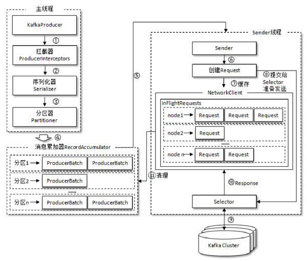
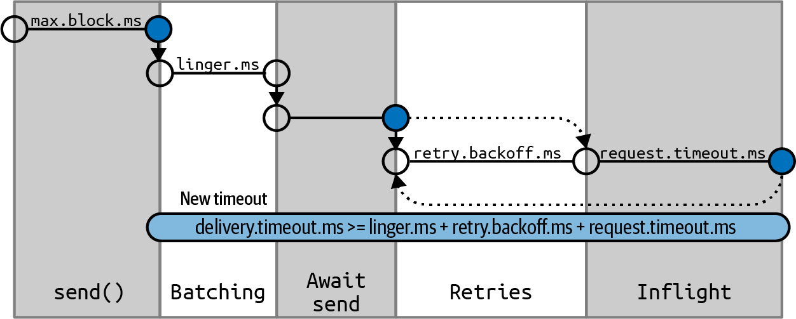
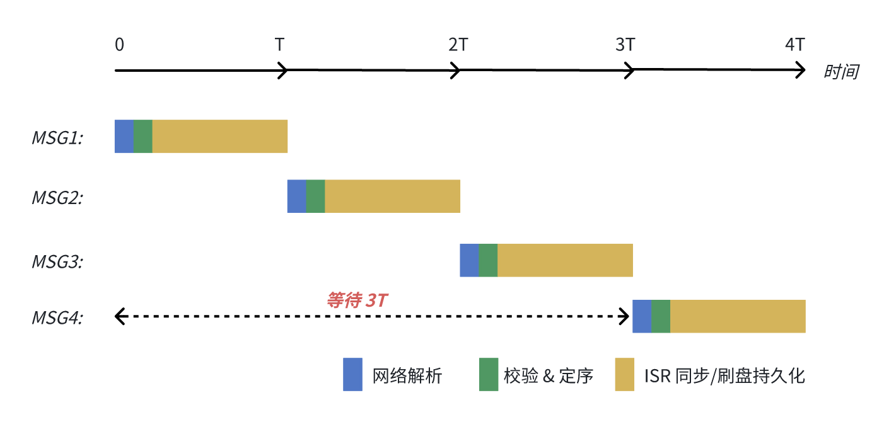
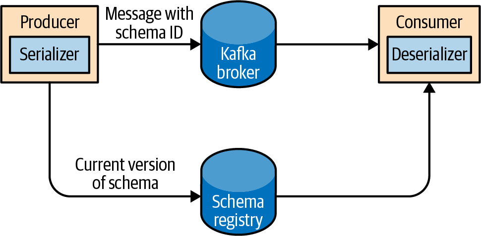
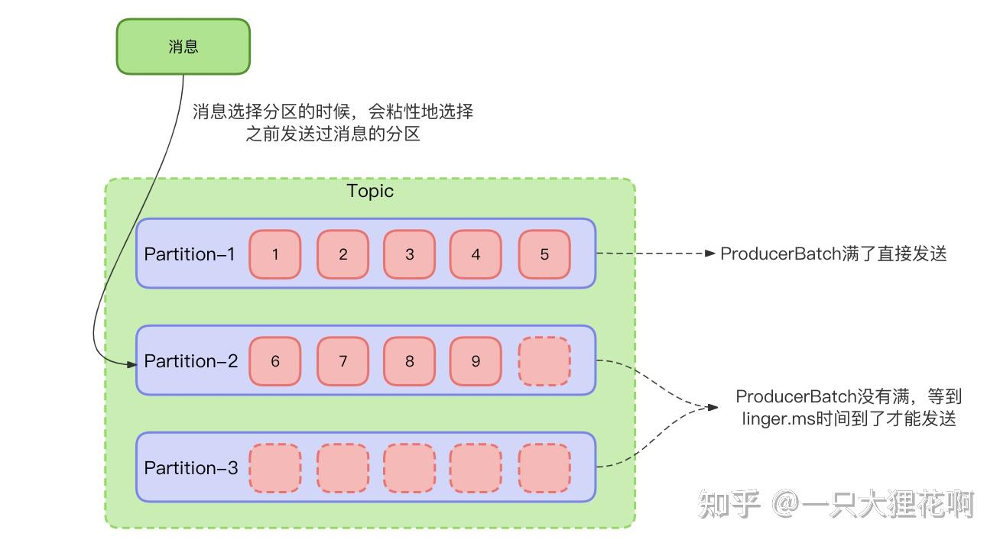
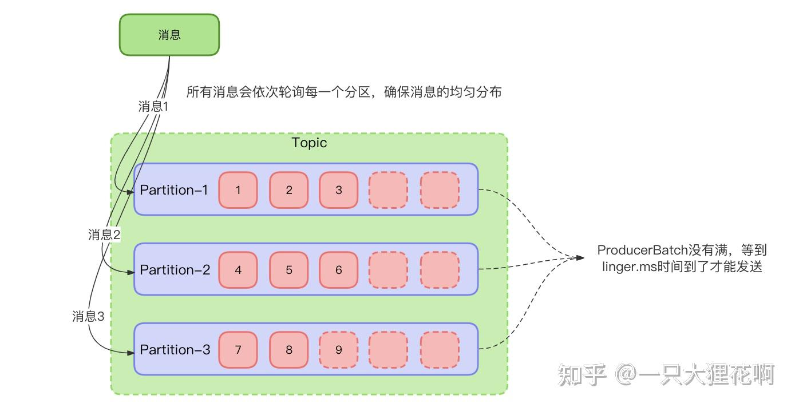

# 生产者

[TOC]

## 整体架构



### 线程

整个生产者客户端由**两种**线程协调运行：

- 主线程：负责拦截、序列化以及分区路由消息
- Sender 线程：负责从消息缓冲区 `RecordAccumulator` 拉取批量消息，发送至 Kafka 集群

主线程就是调用 KafkaProducer 发送消息的业务线程。而 Sender 线程是 KafkaProducer 对象内部私有的。显然 KafkaProducer 是线程安全的。

### 消息累加器

`RecordAccumulator` 主要用来缓存消息，以便 Sender 线程可以批量发送，进而减少网络传输的资源消耗以提升性能。

`RecordAccumulator` 缓存的大小可以通过生产者客户端参数 `buffer.memory` 配置，默认值为 33554432B，即 32MB。如果缓存已满，那么当我们再次调用 send() 方法的时候，就会出现阻塞，如果阻塞超出 `max.block.ms`，那么 send() 就抛出异常。

在 `RecordAccumulator` 的内部为每个分区都维护了一个双端队列，队列中的元素就是`ProducerBatch`。`ProducerBatch` 中可以包含一至多个 `ProducerRecord`。

在 RecordAccumulator 的内部还有一个 BufferPool ，它主要用来实现 ByteBuffer 的复用，减少频繁地创建和释放的次数。不过 BufferPool 只针对特定大小的 ByteBuffer 进行管理，这个特定的大小由 `batch.size` 参数来指定，默认值为16384B，即16KB。

ProducerBatch 的大小和 batch.size 参数也有着密切的关系。

- 当一条消息（ProducerRecord）流入 RecordAccumulator 时，会先寻找与消息分区所对应的双端队列（如果没有则新建）
- 再从这个双端队列的尾部获取一个 ProducerBatch（如果没有则新建）
- 查看是否还可以写入这个 ProducerRecord，如果可以，那么就写入。否则需要创建一个新的 ProducerBatch
- 在新建 ProducerBatch 时，评估这条消息的大小是否超过 batch.size 参数的大小。如果不超过，那么就以 batch.size 参数的大小来创建 ProducerBatch，这样在使用完这段内存区域之后，可以通过 BufferPool 的管理来进行复用；否则，那么就以消息的大小来创建 ProducerBatch ，这段内存区域不会被复用。

注意，Kafka 生产者会在 Batch 填满，或者达到 linger.ms 上限后，才把 Batch 发送给 Sender。这正是平衡高吞吐量与延时的体现

### Sender

Sender 从 RecordAccumulator 中获取缓存的消息之后，将`＜分区，Deque＜ProducerBatch＞＞`转换为`＜Node，List＜ ProducerBatch＞`，其中 Node 表示 Kafka 集群的 broker 节点。这里做了应用逻辑层面到网络I/O层面的转换

- 对于网络连接来说，关注向具体的 broker 节点发送消息，而并不关心消息属于哪一个分区
- 而对于应用逻辑而言，我们只关注向哪个分区中发送哪些消息

接着，Sender 将`＜Node，List＜ProducerBatch＞＞`进一步封装成`＜Node，Request＞`。请求在从 Sender 线程发往 Kafka 之前，还会保存到 InFlightRequests 中。InFlightRequests 保存对象的具体形式为`＜NodeId，Deque＜Request＞＞`，它的主要作用是缓存了已经发出去但还没有收到响应的请求。由配置参数`max.in.flight.requests.per.connection`，来限制每个客户端与 Node 之间的连接个数。

## 构建生产者

Kafka 生产者的属性

- `bootstrap.servers`：代理列表，格式为 `host1:port1,host2:port2`。仅需指定部分代理的地址即可，因为客户端与代理初次成功建立连接后，会获取到更多有关集群的信息，从而得知所有代理的地址。建议至少包含两个代理地址，以便在一个代理宕机时，生产者仍能连接到集群（自动故障转移）。
- `key.serializer`：消息键序列化器，将 Java 对象序列化成 byte 数组以便发送
- `value.serializer`：消息值序列化器

示例：

```java
Properties kafkaProps = new Properties();
kafkaProps.put(ConsumerConfig.KEY_DESERIALIZER_CLASS_CONFIG, StringDeserializer.class.getName());
kafkaProps.put(ConsumerConfig.VALUE_DESERIALIZER_CLASS_CONFIG, StringDeserializer.class.getName());
kafkaProps.put(ConsumerConfig.BOOTSTRAP_SERVERS_CONFIG, "192.0.0.1:9092");

KafkaProducer producer = new KafkaProducer<String, String>(kafkaProps);
```


有三种方式发送消息：

1. **发后即忘（fire-and-forget）**：直接发送消息，不关心是否成功到达

   ```java
   try {
     producer.send(record);
   } catch (Exception e){
     e.printStackTrace();
   }
   ```

   尽管我们无法感知到消息是否发送成功，但如果生产者在将消息发送到 Kafka 之前遇到错误，仍会抛出异常。例如，当消息序列化失败时会抛出 SerializationException ；当缓冲区已满时会抛出 BufferExhaustedException 或 TimeoutException ；如果发送线程被中断，则会抛出 InterruptException

2. **同步发送（synchronous send）**：从技术上讲，Kafka 生产者发送消息始终是异步的，因为 send() 方法会返回一个 Future 对象，可以在其上调用 get() 来同步阻塞获取结果。

   ```java
   try {
     producer.send(record).get();
   } catch (Exception e){
     e.printStackTrace();
   }
   ```

   对于某些错误（例如，连接失败、分区领导者不存在等等），Kafka 会自动重发消息，仅当重试次数耗尽后才抛出异常。但是有些错误无法通过重试来解决，此时 KafkaProducer 会立即抛出异常。

3. **异步发送（asynchronous send）**：可以给 send() 方法传入一个回调函数，当收到响应后触发。

   ```java
   private class DemoProducerCallback implements Callback {
     @Override
     public void onCompletion(RecordMetadata metadata, Exception exception) {
       if (exception != null) {
         exception.printStackTrace();
       }
     }
   }
   ```

   ```JAVA
   producer.send(record, new DemoProducerCallback());
   ```

   注意，回调函数在生产者的 sender 线程里执行。这保证了当我们依次向**同一分区**发送两条消息时，它们的回调将按照发送顺序执行，不同分区之间不保证。回调函数只做轻量级操作，若存在阻塞操作，需将其提交至业务线程池异步处理，否则会拖慢整个 Producer 的所有消息发送。此外，onCompletion 中要做异常兜底处理。


## 配置参数

- `client.id`：客户端标识符

- `acks`：消息在被认为发送成功前，必须写入多少个分区副本

  - `acks=0`：生产者发送消息后，不等待任何服务器响应。如果选择同步/异步发送消息的方式，那么所返回的 metadata 中 offset 为 -1，并且 timestamp.logAppendTime 也是没有意义的。
  - `acks=1`（默认值）：生产者发送消息后，只需等待分区的 Leader Broker 成功将消息写入本地日志
  - `acks=all` 或 `acks=-1`：生产者需要等待 Leader 以及所有 ISR（同步副本） 都确认写入成功后，才算发送成功

  这涉及到吞吐量与数据丢失容忍度的权衡

- Message Delivery Time：

  

  - `max.block.ms`：控制 `send()`、`partitionsFor()` 和事务方法在元数据不可用或生产端缓冲区占满时的最大阻塞时间。默认值为 60000 毫秒（1分钟），超过此时间将抛出 `TimeoutException`

  - `delivery.timeout.ms`：限制单条记录从放入发送队列到确认发送成功的最大总时间（默认 120000 ms，即 2 分钟），它包含批次等待时间、发送时间、服务器确认时间和重试时间。delivery.timeout.ms 必须 ≥ linger.ms + request.timeout.ms，否则配置报错。

    一旦超过 delivery.timeout.ms，无论当前是在重试、在等响应、还是还堵在批次里，都会立刻放弃，并触发 callback 返回超时错误。

  - `request.timeout.ms`：客户端向服务器（Broker）发送请求后，等待响应的最大超时时间（默认 30000 毫秒）

  - `retries`：控制消息发送失败时的最大重试次数，默认值是 Integer.MAX_VALUE (无限重试)

    在旧版本里，你要控制重试多少次用的是 retries。但引入 delivery.timeout.ms 后，官方推荐的思路变成了，只需要告诉 Kafka 「我最多愿意等多久把这条消息送到」，因此不再建议显式设置 retries 了。

  - `retry.backoff.ms`：控制重试时间间隔

  - `linger.ms`：在发送批次前等待更多消息加入的时间（单位：毫秒）。这涉及到吞吐量与延迟的权衡。在打满请求数上限的前提下， `linger.ms` 越大，吞吐量越高。具体证明请见 `batch.size` 参数，将其中 b 重新定义为每个请求平均携带的字节数，此时，linger.ms 与 b 成正比关系，从而可以推出上述结论。

- `buffer.memory`：Producer 端用于缓存等待发送至 Broker 的消息总内存大小。它的默认值为 33554432 字节（即 32 MB）。当数据产生速度超过发送速度时，缓冲区耗尽会导致调用 `send()` 阻塞，直到超出 `max.block.ms` 后 `send()` 抛出异常

- `compression.type`：配置生产者（Producer）对消息批次进行压缩的算法，目前支持以下几种压缩类型：`none`（默认值，不进行压缩）、`snappy`、`lz4`、`gzip`、`zstd`

- `batch.size`：发往单个分区（Partition）的批次缓存大小上限（字节数）。当缓存达到此大小时，Producer 会立即触发网络请求将消息发送出去。这涉及到吞吐量与延迟的权衡。在打满请求数上限的前提下， `batch.size` 越大，吞吐量越高。我们用一个数学模型来验证下这一直觉，设以下变量：

    - b：每个请求携带的字节数（有效批次大小 batch.size）
    - n：允许同时在途、未确认的请求数（max.in.flight.requests.per.connection）
    - R：一个请求从发出到被 broker 确认的往返时间

  **在发送请求数已经到达 n 的前提下**，那么最大吞吐量为
  $$
  T = \frac{n \cdot b}{R}
  $$

  可见 T 与 b 成正比关系。

- `max.in.flight.requests.per.connection`：控制 Producer 在单个连接上已发送但尚未收到 Broker 确认（ACK）的最大请求数，默认值为 5。这涉及到内存占用与吞吐量的权衡。它的建议取值为 $\frac{R}{S}$，超过该取值没有任何的收益，其中 S 为 broker 处理一个请求所需的时间， R 就是上述的往返时间。这是因为吞吐量 T 满足以下关系：
  $$
  T = \min\left(\underbrace{\frac{n \cdot b}{R}}_{\text{窗口受限}},\ \underbrace{\frac{b}{S}}_{\text{服务受限}}\right)
  $$
  当 T 刚好到达最大值时，那么有
  $$
  n = \frac{R}{S}
  $$
  

  >这里需要注意，由于 KafkaChannel 状态机，针对同一条连接， 任意时刻最多仅有一个请求被 Broker 处理，所以上述服务受限就为 $\frac{b}{S}$。以下图为例，即使客户端设置  max.in.flight.requests.per.connection=5，MSG1 ～MSG4 同时到达服务端，MSG4 也要等待前面 3 个请求都处理完成响应后，才能开始处理，最终 MSG4 的发送耗时为 4T
  > 
  
- `max.request.size`：控制单次请求中允许发送的最大字节数（包含消息头、键和值），默认值为 1MB（1048576 字节）。
  
- `receive.buffer.bytes`：Socket 接收缓冲区大小，设置为 -1 即可，直接使用操作系统的默认值。

  >TCP 协议使用滑动窗口算法来提升吞吐量，它允许无需等待 ACK 而继续发送 TCP 包。在不考虑网络丢包的前提下，发送方吞吐量为
  >$$
  >\boxed{T \approx \min(\frac{\text{发送方窗口大小}}{RTT}, BDP)}
  >$$
  >- $\text{发送方窗口大小} = \min(\underbrace{rwnd}_{\text{流量控制}},\ \underbrace{cwnd}_{\text{拥塞控制}})$
  >  - 接收窗口 rwnd：接收方在每个 ACK 里告知发送方当前缓冲区的剩余空间，保护接收方
  >  - 拥塞控制 cwnd：靠丢包/延迟信号来试探网络能承受多少，保护中间网络
  >- 带宽延迟积 $BDP = 发送方\text{带宽} \times RTT$
  >
  >在$带宽延迟积 BDP \leq 发送缓冲区大小$的前提下，如果发送缓冲太小，即使网络和对端都还能接受更多数据，发送方也没地方存这些未确认的数据，只能停下来等 ACK 回来释放空间。如果接收缓冲区太小，会导致窗口大小缩减，直接限制发送端的数据发送速率。
  >
  >多数内核支持缓冲区自动调优（autotuning），我们无需手动调整。

- `send.buffer.bytes`：Socket 发送缓冲区大小

- `enable.idempotence`：是否启用幂等。如果要启用，必须满足 `max.in.flight.requests.per.con⁠nection <= 5`、`retries > 0` 以及 `acks=all`，否则抛出 ConfigException


## 序列化器

内置的序列化器有：StringSerializer、ByteArraySerializer、IntegerSerializer。可以通过实现 Serializer 接口来自定义序列化器 

```java
package org.apache.kafka.common.serialization;

public interface Serializer<T> extends Closeable {

    /**
     * 序列化器由 KafkaProducer 初始化时所回调的函数
     
     * @param configs KafkaProducer 的配置
     * @param isKey 标记当前序列化器用于消息 Key（true）还是消息 Value（false）
     */
    default void configure(Map<String, ?> configs, boolean isKey) {
        
    }

    /**
     * Convert {@code data} into a byte array.
     *
     * @param topic topic associated with data
     * @param data typed data
     * @return serialized bytes
     */
    byte[] serialize(String topic, T data);

    /**
     * Convert {@code data} into a byte array.
     *
     * @param topic topic associated with data
     * @param headers headers associated with the record
     * @param data typed data
     * @return serialized bytes
     */
    default byte[] serialize(String topic, Headers headers, T data) {
        return serialize(topic, data);
    }

    /**
     * Close this serializer.
     * This method must be idempotent as it may be called multiple times.
     */
    @Override
    default void close() {
        // intentionally left blank
    }
}
```


## 与 Avro 集成

Apache Avro 是一个数据序列化框架，其特点如下：

1. 使用 JSON 格式来描述 Schema，可读性好
2. 数据编码成紧凑的二进制（不存字段名、不存类型标记，只存纯粹的值，靠 Schema 的字段顺序来解析）
3. 支持 Schema 演进，即 Writer Schema 和 Reader Schema 不同时依然能正确解析
4. Avro 还内置了 RPC 框架（实际上不怎么用）


引入 Avro，Maven 依赖如下：

```xml
<dependencies>
      <dependency>
          <groupId>org.apache.avro</groupId>
          <artifactId>avro</artifactId>
          <version>1.11.3</version>
      </dependency>
  </dependencies>

  <!-- 仅静态模式需要：编译 .avsc 生成 Java 类 -->
  <build>
      <plugins>
          <plugin>
              <groupId>org.apache.avro</groupId>
              <artifactId>avro-maven-plugin</artifactId>
              <version>1.11.3</version>
              <executions>
                  <execution>
                      <phase>generate-sources</phase>
                      <goals><goal>schema</goal></goals>
                      <configuration>
                          <sourceDirectory>${project.basedir}/src/main/avro/</sourceDirectory>
                          <outputDirectory>${project.basedir}/target/generated-sources/avro/</outputDirectory>
                      </configuration>
                  </execution>
              </executions>
          </plugin>
      </plugins>
  </build>
```

Schema 定义：

```json
{
    "type": "record",
    "name": "User",
    "namespace": "cn.atsukoruo",		// 决定在哪个包下面生成
    "fields": [
      {"name": "id",    "type": "int"},
      {"name": "name",  "type": "string"},
      {"name": "email", "type": ["null", "string"], "default": null}
    ]
}
```


有以下两种使用方式：

- 动态模式（Generic）：不生成任何类，运行时加载 .avsc，用 GenericRecord 按字段名读写

  ```java
  public class GenericModeDemo {
  
    public static void main(String[] args) throws Exception {
      // ---- 0. 运行时加载 Schema（这里直接从字符串解析，实际可从文件读）---
      String schemaJson = """
      {
        "type": "record",
        "name": "User",
        "namespace": "com.example.avro",
        "fields": [
          {"name": "id",    "type": "int"},
          {"name": "name",  "type": "string"},
          {"name": "email", "type": ["null", "string"], "default": null}
        ]
      }
      """;
        Schema schema = new Schema.Parser().parse(schemaJson);
  
      // ================= 序列化 =================
      GenericRecord user = new GenericData.Record(schema);
      user.put("id", 1001);
      user.put("name", "Tom");
      user.put("email", "tom@example.com"); 
      byte[] bytes = serialize(schema, user);
  
      // ================= 反序列化 =================
      GenericRecord result = deserialize(schema, bytes);
      System.out.println("id    = " + result.get("id"));
      System.out.println("name  = " + result.get("name"));
      System.out.println("email = " + result.get("email"));
    }
  
  
    static byte[] serialize(Schema schema, GenericRecord record) throws IOException {
      // DatumWriter 负责“按 Schema 把对象拆成字段”
      DatumWriter<GenericRecord> writer = new GenericDatumWriter<>(schema);
      ByteArrayOutputStream out = new ByteArrayOutputStream();
      // BinaryEncoder 负责“把字段值写成紧凑二进制”
      BinaryEncoder encoder = EncoderFactory.get().binaryEncoder(out, null);
      writer.write(record, encoder);
      encoder.flush();
      return out.toByteArray();
    }
  
  
    static GenericRecord deserialize(Schema schema, byte[] bytes) throws IOException {
      DatumReader<GenericRecord> reader = new GenericDatumReader<>(schema);
      // 可以使用 GenericDatumReader(Schema writer, Schema reader) 来支持 Schema 演进
      BinaryDecoder decoder = DecoderFactory.get().binaryDecoder(bytes, null);
      return reader.read(null, decoder);
    }
  }
  ```

- 静态模式（Specific）：先用 avro-maven-plugin 把 User.avsc 编译成 com.example.avro.User 类（mvn generate-sources），然后用强类型对象读写

  ```java
  public class SpecificModeDemo {
  
    public static void main(String[] args) throws Exception {
      // ================= 序列化 =================
      // 1. 用生成类的 Builder，强类型、有编译期检查、有 IDE 补全
      User user = User.newBuilder()
        .setId(1001)
        .setName("Tom")
        .setEmail("tom@example.com")
        .build();
      byte[] bytes = serialize(user);
  
      // ================= 反序列化 =================
      User result = deserialize(bytes);
      System.out.println("id    = " + user.getId());
      System.out.println("name  = " + user.getName());
      System.out.println("email = " + user.getEmail());
    }
  
    /** 序列化：User -> byte[] */
    static byte[] serialize(User user) throws IOException {
      // 注意用的是 SpecificDatumWriter，schema 从 User.getClassSchema() 内嵌获取
      DatumWriter<User> writer = new SpecificDatumWriter<>(User.class);
      ByteArrayOutputStream out = new ByteArrayOutputStream();
      BinaryEncoder encoder = EncoderFactory.get().binaryEncoder(out, null);
      writer.write(user, encoder);
      encoder.flush();
      return out.toByteArray();
    }
  
    /** 反序列化：byte[] -> User */
    static User deserialize(byte[] bytes) throws IOException {
      DatumReader<User> reader = new SpecificDatumReader<>(User.class);
      // 可以使用 SpecificDatumReader(Schema writer, Schema reader) 构造函数来支持 Schema 演进
      
      BinaryDecoder decoder = DecoderFactory.get().binaryDecoder(bytes, null);
      return reader.read(null, decoder);
    }
  }
  ```
  
  

当 Kafka 使用 Avro 作为序列化器时，对于 Schema 演进有两种应对方案：

1. 每个消息体里面包括 writeSchema 的 JSON 定义，这种开销显然是不可接受的

2. 使用 Schema Registry 模式，消息体里仅包含 Schema ID。当 Consumer 反序列化时，根据 ID 去 Registry 获取 Schema 定义，并缓存在本地。

   confluent 三方件实现了 Schema Registry，并提供了相应的序列化器

   

   

Maven 依赖：

```xml
<repositories>
  <repository>
    <id>confluent</id>
    <url>https://packages.confluent.io/maven/</url>
  </repository>
</repositories>
</dependencies>        
<dependency>
  <groupId>io.confluent</groupId>
  <artifactId>kafka-avro-serializer</artifactId>
  <version>7.5.0</version>
  <scope>compile</scope>
</dependency>
</dependencies>
```

生产者：

```java
Properties props = new Properties();
// ...
// 使用 Avro 的序列化器
props.put(ProducerConfig.VALUE_SERIALIZER_CLASS_CONFIG, KafkaAvroSerializer.class.getName());
// 告诉序列化器 Registry 在哪
props.put("schema.registry.url", "http://localhost:8081");
// 可选：找不到 schema 时自动注册（开发方便，生产环境常设为 false，改用 CI 预注册）
props.put("auto.register.schemas", "true");

try (KafkaProducer<String, User> producer = new KafkaProducer<>(props)) {
  User user = User.newBuilder()
    .setId(1001)
    .setName("Tom")
    .setEmail("tom@example.com")
    .build();
  ProducerRecord<String, User> record = new ProducerRecord<>("users", "user-1001", user);
  producer.send(record);
}
```

消费者：

```java
Properties props = new Properties();
// ...
props.put(ConsumerConfig.VALUE_DESERIALIZER_CLASS_CONFIG,
          KafkaAvroDeserializer.class.getName());
props.put("schema.registry.url", "http://localhost:8082");

try (KafkaConsumer<String, GenericRecord> consumer = new KafkaConsumer<>(props)) {
  consumer.subscribe(List.of("users"));
  while (true) {
    ConsumerRecords<String, GenericRecord> records = consumer.poll(Duration.ofMillis(500));
    for (ConsumerRecord<String, GenericRecord> r : records) {
      GenericRecord v = r.value();
      System.out.println("id="   + v.get("id")
                         + " name=" + v.get("name")
                         + " email=" + v.get("email"));
    }
  }
}
```

只需加一行配置，反序列化器就返回生成类而非 GenericRecord：

```java
props.put("specific.avro.reader", "true");
try (KafkaConsumer<String, User> consumer = new KafkaConsumer<>(props)) {
  consumer.subscribe(List.of("users"));
  while (true) {
    ConsumerRecords<String, User> records =
      consumer.poll(Duration.ofMillis(500));
    for (ConsumerRecord<String, User> r : records) {
      User u = r.value();                 // 直接强类型
      System.out.println(u.getId() + " " + u.getName() + " " + u.getEmail());
    }
  }
}
```


服务端：

```shell
# 1. 下载 Confluent Community 包（选一个版本，如 7.6.0）
wget https://packages.confluent.io/archive/7.6/confluent-community-7.6.0.tar.gz

# 2. 解压
tar -xzf confluent-community-7.6.0.tar.gz

# 3. 配置环境变量（可选，方便调用）
export CONFLUENT_HOME=../confluent
export PATH=$PATH:$CONFLUENT_HOME/bin
```

编辑配置文件 etc/schema-registry/schema-registry.properties：

```properties
# 监听地址
listeners=http://0.0.0.0:8082

# 指向 Kafka broker
kafkastore.bootstrap.servers=PLAINTEXT://localhost:9092

# schema 存储用的 topic
kafkastore.topic=_schemas
```

后台启动

```shell
$CONFLUENT_HOME/bin/schema-registry-start -daemon $CONFLUENT_HOME/etc/schema-registry/schema-registry.properties
```

验证：

```shell
curl http://localhost:8082/subjects
# 返回 [] 说明服务已正常运行
```

## 分区

由配置项 `partitioner.class` 指定所使用的分区器，默认值为 DefaultPartitioner。默认分区器的分区逻辑是，如果消息没携带 key，那么就执行粘性分区策略，否则就执行 Key-Ordering 策略。

```java
properties.put(ProducerConfig.PARTITIONER_CLASS_CONFIG, DemoPartitioner.class.getName());
```


如果在发送消息时指定了分区序号，那么就直接发送到该分区，不再应用分区策略，通常不建议这样做。

```java
ProducerRecord<String, String> r1 = new ProducerRecord<>("my-topic", 2, "user-A", "hello");
```

### 粘性分区策略



优先将消息填充到上一个消息所填充到的 ProducerBatch 中，如果尝试放到上一个 ProducerBatch 中失败（已经超时 linger.time 发送，或者累计大小超过了 batch.size），那么就填充到新的分区下的 ProducerBatch。新分区选择策略如下：

1. 可用分区数 < 1：在所有分区中随机选择
2. 可用分区数 = 1：直接选择该分区
3. 可用分区数 > 1：在所有可用分区中随机选择，但必须排除掉旧分区

### 轮询分区策略



当可用分区不为空，那么将消息发送到的分区序号是「消息总数 % 可用分区数」，否则就是「消息总数 % 所有分区数」

### Key-Ordering 策略

对序列化之后的 Key 使用 murmur2 算法计算出 hashcode，然后取模分区总数获取到要发送的分区序号。

### 自定义

```java
public interface Partitioner extends Configurable, Closeable {

    /**
     * Compute the partition for the given record.
     *
     * @param topic The topic name
     * @param key The key to partition on (or null if no key)
     * @param keyBytes The serialized key to partition on( or null if no key)
     * @param value The value to partition on or null
     * @param valueBytes The serialized value to partition on or null
     * @param cluster The current cluster metadata
     */
    public int partition(String topic, Object key, byte[] keyBytes, Object value, byte[] valueBytes, Cluster cluster);

    /**
     * This is called when partitioner is closed.
     */
    public void close();


    /**
     * Notifies the partitioner a new batch is about to be created. When using the sticky partitioner,
     * this method can change the chosen sticky partition for the new batch. 
     * @param topic The topic name
     * @param cluster The current cluster metadata
     * @param prevPartition The partition previously selected for the record that triggered a new batch
     */
    default public void onNewBatch(String topic, Cluster cluster, int prevPartition) {
    }
}

public interface Configurable {
    /**
     * KafkaProducer 初始化时，会回调该函数，将 Properties 以 Map 形式传入
     */
    void configure(Map<String, ?> configs);

}

```

示例：

```java
public class MyPartitioner implements Partitioner {
    private int currentPartition = 0;

    @Override
    public int partition(String topic, Object key, byte[] keyBytes, 
                         Object value, byte[] valueBytes, Cluster cluster) {
        // 无 key 时，使用轮询策略，但按新 batch 切换分区
        if (keyBytes == null) {
            return currentPartition;
        }
        // 有 key 时按 key 哈希
        return Utils.murmur2(keyBytes) % cluster.partitionCountForTopic(topic);
    }

    @Override
    public void onNewBatch(String topic, Cluster cluster, int prevPartition) {
        // Batch 满了，轮询到下一个分区
        currentPartition = (prevPartition + 1) % cluster.partitionCountForTopic(topic);
    }
}
```


## 消息头

元数据结构。它允许在不修改消息体（Payload）的情况下为消息添加描述性键值对，常用于链路追踪（Trace ID）、消息路由等等。Key 必须是 String，而值是任何可以序列化的对象

```java
ProducerRecord<String, String> record =
new ProducerRecord<>("CustomerCountry", "Precision Products", "France");

record.headers().add("privacylevel","YOLO".getBytes(StandardCharsets.UTF_8));
```

## 拦截器

```java
public interface ProducerInterceptor<K, V> extends Configurable {
    public ProducerRecord<K, V> onSend(ProducerRecord<K, V> record);

    public void onAcknowledgement(RecordMetadata metadata, Exception exception);

    /**
     * This is called when interceptor is closed
     */
    public void close();
}
```

- `onSend`：KafkaProducer 在将消息序列化和计算分区之前，会调用生产者拦截器的 onSend() 方法，来对消息进行相应的定制化操作，要注意以下几点
  - 必须满足幂等性，否则日志压缩算法会不按照预期工作。
  - 不建议修改 ProducerRecord 的 topic、key、partition 等
  - 所抛出的异常会被静默处理掉，不用影响 send() 的执行，但还是建议异常兜底
- `onAcknowledgement`：在消息应答（Acknowledgement）之前，或消息发送失败时，调用该方法，它在用户设定的 callback 之前执行。这个方法运行在 Produce 的 Sender 线程中，所以不要执行阻塞操作，否则会影响到消息的发送速度。


由配置项 interceptor.classes 来指定拦截器。

```java
properties.put(ProducerConfig.INTERCEPTOR_CLASSES_CONFIG, ProducerInterceptorPrefix.class.getName());
```

支持设置拦截链（多个拦截器），它们会按照顺序依次执行，当前拦截器以上一个拦截器的输出内容作为输入继续处理。如果某个拦截器抛出异常，不会导致拦截链断开。各个拦截器之间不要相互依赖，否则若某个拦截器抛出异常未正常修改消息，将会产生不可预期的副作用。

```java
properties.put(ProducerConfig.INTERCEPTOR_CLASSES_CONFIG, ProducerInterceptorPrefix.class.getName() + "," + ProducerInterceptorSuffix.class.getName());
```

ProducerInterceptor 的回调方法可能被多线程并发调用；如需线程安全，拦截器实现必须自行保证。

## 配额与限流

Kafka 的配额与限流（Quota）主要在 Broker 端生效，通过限制特定客户端的资源使用（字节数或请求率），防止单个业务或恶意应用压垮集群。支持以下两种主要配额类型：

- 网络带宽配额（Network Bandwidth Quotas）：限制生产者每秒可以写入 Broker 的最大字节数。
- 请求速率配额（Request Rate Quotas）：限制客户端请求占用 Broker 处理线程的时间百分比

当超出设定的配额时，Kafka 不会直接抛出异常，而是让该客户端的请求发生阻塞（Delayed Operation）或者在响应中返回节流延迟（Throttle Time），迫使客户端减慢发送速度，可能会导致客户端抛出 TimeoutException 异常 。

可以通过以下 JMX 指标来监控限流执行情况：

- produce-throttle-time-avg：生产者被 Broker 限流的平均时长（ms）
- produce-throttle-time-max：生产者被 Broker 限流的最长时长（ms）


Broker 配置文件中的静态配置参数，需要重启 Broker 才能生效

- `quota.producer.default`: 为所有 Producer 客户端设定的默认配额。例如设定为 10MB/s：`quota.producer.default=10485760`
- `quota.producer.override`: 为指定的特定客户端（`client.id`）设置的具体配额限制，覆盖默认配额。例如限制 clientA 为 2MB/s，clientB 为 5MB/s：
  `quota.producer.override="clientA:2097152,clientB:5242880"`


可以使用 Kafka 自带的 `kafka-configs.sh` 脚本在集群中动态调整这些配额，无需重启 Broker。常用的动态配置参数包括：

- `producer_byte_rate`：限制生产者的字节速率（以字节/秒为单位）。
- `request_percentage`：限制客户端请求在处理线程中占用的百分比（范围 0 ~ 100）

使用场景如下：

- 场景一：限制指定 `client.id` 的生产流量

  ```bash
  #限制 client.id 为 my-heavy-producer 的发送速率为每秒 10 MB
  bin/kafka-configs.sh --bootstrap-server localhost:9092 --alter \
    --add-config 'producer_byte_rate=10485760' \
    --entity-name clientC --entity-type clients
  ```

- 场景二：限制整个用户（User）的流量，前提开启了 SASL 认证

  ```bash
  bin/kafka-configs.sh --bootstrap-server localhost:9092 --alter \
    --add-config 'producer_byte_rate=52428800' \
    --entity-name user1 --entity-type users
  ```

- 场景三：修改默认配额

  ```bash
  bin/kafka-configs --bootstrap-server localhost:9092 --alter --add-config 'consumer_byte_rate=2048' --entity-type users
  ```

