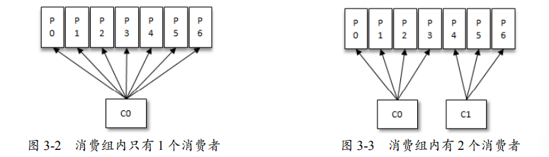
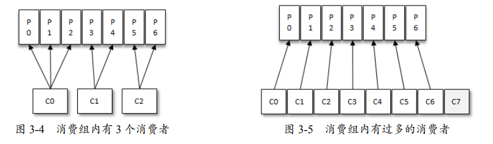
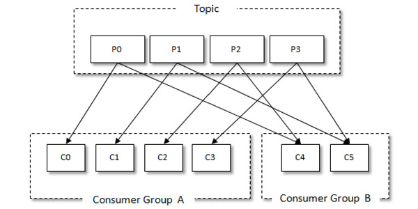
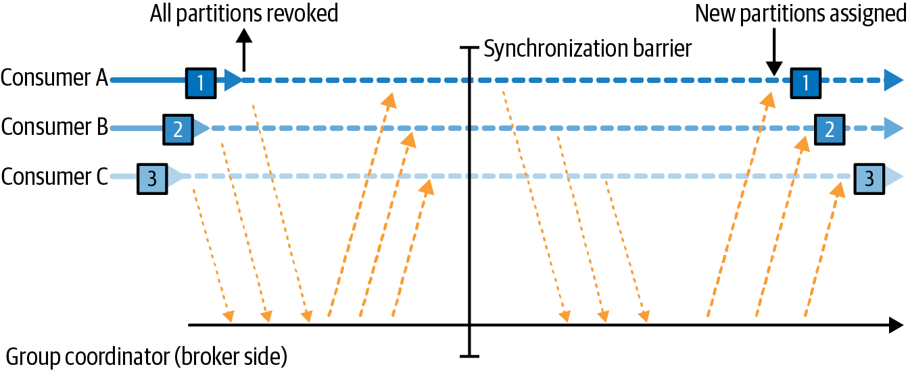
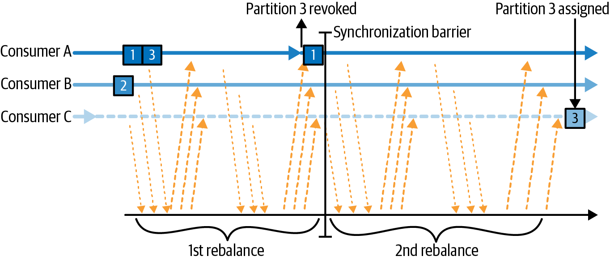
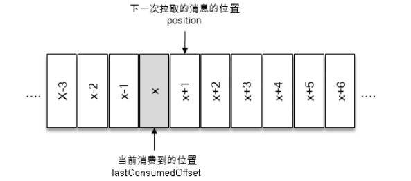
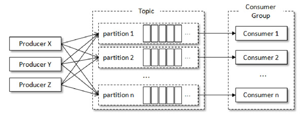
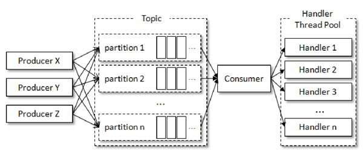

# 消费者

[TOC]

## 概念

### 消费者与消费者组

消费者（Consumer）负责订阅 Kafka 中的主题（Topic），并且从订阅的主题上主动拉取消息。我们从 Kafka 主题扩展数据消费能力的主要方式，是向消费者组中添加更多消费者。但请注意，在默认的分区分配策略下，主题下每一个分区都只会被唯一地投递给消费组中的一个消费者，因此如果添加的消费者数量超过主题的分区数，则有部分消费者将处于空闲状态（鸽巢原理）





此外，可以有多个消费组订阅同一个 Topic。这解决了「同一份数据流被多个独立业务并行、隔离、互不干扰地消费」的问题。它靠「每个消费组维护自己的offset」实现——让 Kafka 既是一条数据总线，又能让任意多的下游各取所需，把生产者和所有消费者彻底解耦。


### 消息投递模式

对于消息中间件而言，一般有两种消息投递模式：

- 点对点（P2P，Point-to-Point）模式
- 发布/订阅（Pub/Sub）模式（一对多）

Kafka 同时支持两种消息投递模式，而这正是得益于消费者与消费组模型的契合：

- 如果所有的消费者都隶属于同一个消费组，那么所有的消息都会被均衡地投递给每一个消费者，即每条消息只会被一个消费者处理，这就相当于点对点模式的应用。
- 如果所有的消费者都隶属于不同的消费组，那么所有的消息都会被广播给所有的消费者，即每条消息会被所有的消费者处理，这就相当于发布/订阅模式的应用。




### 订阅模式

在 Apache Kafka 中，消费者有两种订阅模式：

- 自动分配（subscribe）：分区分配策略自行决定消费者消费哪些分区的消息。

- 手动分配（assign）：消费者可以直接订阅特定的分区，此时，它就不再参与到该组的自动分区分配中。

  当 ConsumerA（`subscribe` 模式）与 ConsumerB（`assign` 模式）共用同一个 `group.id=C`，且同时消费 `topicA` 的 `partition 0` 时，两者会向 `__consumer_offsets` 中同一个 key `(groupId=C, topic=topicA, partition=0)` 提交各自的消费位点，导致 offset 被后提交者覆盖，引发重复消费或消息丢失。虽然将 ConsumerB 的 `group.id` 改为其他值可避免覆盖，但根本解决方案是禁止在同一业务场景下混用 `subscribe()` 与 `assign()`。

  

### 心跳

消费者通过向被指定为「组协调器」（GroupCoordinator）的 Kafka Broker 发送心跳，来维持在消费者组中的成员身份及其对所分配分区的所有权（不同消费者组的协调器代理可能不同）。心跳由消费者的后台线程发送，只要消费者定期发送心跳，即被视为处于存活状态。

如果消费者停止发送心跳的时间过长，其会话将超时，GroupCoordinator 会将其视为已失效并触发重平衡。当正常关闭消费者时，它会通知 GroupCoordinator 即将退出，GroupCoordinator 将立即触发重平衡。

### 重平衡

将分区所有权从一个消费者转移到另一个消费者的过程称为重平衡，它为消费者组提供了高可用性和可扩展性。根据消费者组所使用的分区分配策略，重平衡分为两种类型：

- 急切式重平衡（Eager rebalances）：所有消费者都会停止消费，放弃其对所有分区的所有权，重新加入消费者组，并获得全新的分区分配。这会导致整个消费者组出现短暂的不可用窗口（stop-the-world）

  

- 协作式重平衡（Cooperative rebalances，也称为 Incremental rebalances）：仅涉及将少量分区从一个消费者重新分配给另一个消费者

  

消费组在某个主题上所采用的重平衡方式由各个消费者共同选举出的 `partition.assignment.strategy` 参数决定：若为`CooperativeStickyAssignor` 则启用协作式重平衡，其余情况均使用急切式重平衡。


当消费者想要加入一个组时，它会向 GroupCoordinator 发送一个 JoinGroup 请求。第一个加入该组的消费者将成为**「组领导者」（GroupLeader）**。

GroupLeader 从 GroupCoordinator 处接收组内所有消费者的列表，并负责为组内每个消费者分配分区（PartitionAssignor 接口）。在确定分区分配后，GroupLeader 将分配列表发送给 GroupCoordinator，后者再将此列表发送给所有消费者，但个消费者只能看到自己的分配情况。

KIP-848：Apache Kafka 4.0 的全新消费者重平衡协议-Consumer Rebalance Protocol，将协调逻辑从客户端移至 Broker 端的 Group Coordinator，是真正意义上的增量/异步协议。仅需在客户端设置 `group.protocol=consumer` 即可。

### 静态组成员关系

默认情况下，消费组内消费者的成员身份是临时的。一旦消费者退出消费组，其持有的分区分配关系将被回收；待该消费者重新入组时，集群会触发再次重平衡流程，并为其生成全新成员 ID。

如果为消费者指定了 group.instance.id，那么就会成为组内的静态成员。那么当它主动退出了消费组时，并不会发送 LeaveGroup 请求，此时 GroupCoordinator 会认为它还存活。当在会话超时（session.timeout.ms，默认 45s）期间内，如果该静态成员重新加入消费者组，那么 GroupCoordinator 把之前缓存的分区分配结果发送给它，在此期间并不会触发重平衡。

## 创建消费者

```java
// 配置消费者
Properties props = new Properties();
props.put(ConsumerConfig.BOOTSTRAP_SERVERS_CONFIG, "154.21.200.186:9092");
props.put(ConsumerConfig.GROUP_ID_CONFIG, "CountryCounter");
props.put(ConsumerConfig.KEY_DESERIALIZER_CLASS_CONFIG, StringDeserializer.class.getName());
props.put(ConsumerConfig.VALUE_DESERIALIZER_CLASS_CONFIG, StringDeserializer.class.getName());

KafkaConsumer<String, String> consumer = new KafkaConsumer<>(props);

// 订阅主题
consumer.subscribe(Collections.singletonList("customerCountries"));

// 死循环消费消息
Duration timeout = Duration.ofMillis(100);
while (true) {
  ConsumerRecords<String, String> records = consumer.poll(timeout);
  for (ConsumerRecord<String, String> record : records) {
    System.out.printf("topic = %s, partition = %d, offset = %d, customer = %s, country = %s\n", record.topic(), record.partition(), record.offset(), record.key(), record.value());
  }
}
```

集合订阅的方式`subscribe(Collection)`、正则表达式订阅的方式`subscribe(Pattern)`和指定分区的订阅方式 `assign(Collection)`，分别代表了三种不同的订阅状态：`AUTO_TOPICS`、`AUTO_PATTERN`和`USER_ASSIGNED`（如果没有订阅，那么订阅状态为`NONE`）。然而这三种状态是互斥的，消费者中只能使用其中的一种，否则会报出`IllegalStateException`异常。

- 集合订阅

  ```java
  consumer.subscribe(Arrays.asList("topic1", "topic3"));
  ```

- 正则表达式订阅

  ```java
  consumer.subscribe(Pattern.compile("test.*"));
  ```

  注意，正则过滤发生在客户端，这就意味着消费者定期向 Broker 请求整个集群所有 Topic 及其 Partition 的列表，再找出符合的 Topic 并自动订阅。但当集群分区数量庞大时（30000+），此时拉取元数据的带宽开销甚至比拉取业务消息的还要大，不可接受。

- 分区订阅

  ```java
  consumer.assign(List.of(new TopicPartition("topic-demo", 0),new TopicPartition("topic-demo", 1)));
  ```

  

poll() 所做的事情远不止获取数据，还包括：

- 当消费者首次调用 poll() 时，会首先查找 GroupCoordinator，然后向其发送 JoinGroup、SyncGroup 请求以加入消费者组，最后接收到 Coordinator 分配给自己的分区。
- 参与重平衡过程
- 触发注册的回调，例如 OffsetCommitCallback、onPartitionsAssigned

这意味着，几乎所有发生在消费者的错误，都表现为由 poll() 抛出的异常。

请注意，如果从上一次 poll() 返回到下一次调用 poll() 的时间间隔（业务处理耗时）超过 `max.poll.interval.ms` ，那么该消费者会主动从消费者内退出，触发重平衡。如果由于超时被踢出后又重新 `poll()`，那么会静默重新尝试加入该组中。


在旧版本的 Kafka 中，poll 完整的方法签名为 `poll(long)`。该方法会一直阻塞直到从 Kafka 获取到所需的元数据，即使超出了指定的超时时长。而新方法 `poll(Duration)` 则严格遵守超时限制，不会等待元数据。因此，之前通常使用 `poll(0)` 来强制客户端拉取元数据，而不消费任何记录。但在新版 API 中，`poll(Duration.ofMillis(0))` 并不能达到同样的效果。一种解决方案是将相关逻辑放到 `rebalanceListener.onPartitionAssignment()` 方法中。该方法保证在客户端获取到所分配分区的元数据之后、记录开始消费之前被调用，因此可以可靠地完成元数据相关的初始化工作。

请看下面一段代码：

```java
private static boolean finished = false;
private static class HandleRebalance implements ConsumerRebalanceListener {
  public void onPartitionsAssigned(Collection<TopicPartition>
                                   partitions) {
    System.out.println("has assigned");
    finished = true;
  }
}

consumer.subscribe(List.of("users"), new HandleRebalance());
while (!finished) {
  ConsumerRecords<String, User> records = consumer.poll(Duration.ofMillis(2));
  System.out.println("has poll");
  Set<TopicPartition> assignedPartitions = consumer.assignment();
  if (CollectionUtils.isEmpty(assignedPartitions)) {
    continue;
  }
  System.out.printf("the assigment size: %d %n", assignedPartitions.size());
}

// 输出
has poll
has poll
...
has poll
has assigned
has poll
the assigment size: 1
```

如果将 `Duration.ofMillis(2)` 改为 `2`，那么输出

```
has assigned
has poll
the assigment size: 1
```


部分 API（例如， `seek`）必须依赖分区元数据，否则会抛出 `IllegalStateException`。除 Rebalance 监听器外，也可以用循环调用 `poll(Duration)` 的方式等待元数据就绪：

```java
Set<TopicPartition> assignment = consumer.assignment();
while (assignment.size() == 0) {
    consumer.poll(Duration.ofMillis(1000));
    assignment = consumer.assignment();
}
```

## 配置参数

- `fetch.min.bytes`：指定服务器在响应消费者拉取请求时，必须返回的最小数据量（以字节为单位），默认值是 1 字节（立即返回消息）

- `fetch.max.wait.ms`：：当 Broker 里的数据量不满足 `fetch.min.bytes` 时，最多等待多久才把数据返回给消费者，默认值是 500 毫秒（ms）

- `fetch.max.bytes`：指定消费者在单次拉取请求中从服务器获取的最大数据总量（单位为字节），默认值 50MB。注意，为了避免消费进度卡住，服务器至少会返回一条消息，即使它超过了这个限制。

- `max.poll.records`：单次拉取返回的最大消息数量，默认值为 500。

- `max.partition.fetch.bytes`：于限制每个分区单次拉取返回的最大数据量（字节数），默认值为 1MB。与 `fetch.max.bytes` 类似，服务器至少会返回一条消息。

- `session.timeout.ms`：用于设置消费者与服务端之间的会话超时时间。如果消费者在此时间内未向服务端发送心跳，服务端会认为该消费者已挂掉，并将其踢出消费组，从而触发再平衡。

- `heartbeat.interval.ms`：用于指定消费者向群组协调器发送心跳的时间间隔，默认值通常为 3000ms。通常建议将 `heartbeat.interval.ms` 设置为 `session.timeout.ms` 的 1/3 

- `max.poll.interval.ms`：消费者两次调用 `poll()` 方法之间的最大允许时间间隔（默认值为 300000 毫秒，即 5 分钟）。如果在此时间内未调用 `poll()`，消费者会被认为发生死锁无法消费消息，即使心跳仍在发送，从而被踢出消费组并触发重平衡

- `default.api.timeout.ms`：客户端 API 操作的默认超时时间（默认 60000 毫秒，即 1 分钟）。适用于没有显式传入 `timeout` 参数的所有客户端 API 操作（例如，同步提交偏移量 `commitSync`、获取特定时间戳偏移量等）

- `request.timeout.ms`：控制客户端等待服务端响应请求的最长时间。默认值为 30000ms（30秒）。若超时未收到响应，客户端会关闭连接并尝试重新连接

- `auto.offset.reset`：用于决定当消费者在 Kafka 中没有初始偏移量（offset），或者当前偏移量无效（如数据被删除或过期）时，消费者应该从何处开始读取数据。

  - `latest`（默认值）：从该分区最新的一条记录开始读取
  - `earliest`：从该分区最早的记录开始读取
  - `none`：如果没有为消费者组找到先前的偏移量，就向消费者抛出异常

- `enable.auto.commit`：用于决定是否自动提交消费位移（Offset）。默认值为 `true`（自动提交），配合 `auto.commit.interval.ms`定期触发

- `partition.assignment.strategy`：用于决定消费者组（Consumer Group）内的各个消费者实例如何分配订阅主题的分区

  - `Range`：按主题（Topic）为单位进行分配。对于每个主题，将分区总数除以所订阅该主题的消费者数，按整除结果划分跨度，依次将分区分配给消费者，余数分给靠前的消费者

    我们来看一个例子，假设有 2 个主题，且每个都有 3 个分区，分别标识为：t0p0、 t0p1、t0p2、t1p0、t1p1、t1p2。消费组内有 2 个消费者 C0 和 C1，均订阅了这些主题。那么最终的分配结果为：

    - 消费者 C0：t0p0、t0p1、t1p0、t1p1
    - 消费者 C1：t0p2、t1p2

    再来看一个例子，假设有 2 个主题，每个都有 2 个分区。消费组内有 3 个消费者，均订阅了这些主题。那么最终分配结果为

    - 消费者 C0：t0p0、t1p0、t2p0
    - 消费者 C1：t0p1、t1p1、t2p1
    - 消费者 C2：无

  - `RoundRobin`：将消费组内全部消费者，以及其订阅主题所对应的所有分区按字典序排序。采用轮询策略依次分配分区：按序遍历每个分区，使用循环指针在消费者列表轮转；指针指向的消费者若订阅该分区所属主题，则将分区分配给该消费者；若未订阅则跳过，但指针仍向后移动，继续查找下一位符合订阅条件的消费者。

    下面给出一个例子：消费组内有 3 个消费者（C0、C1 和 C2），它们共订阅了 3 个主题（t0、t1、 t2），这 3 个主题分别有 1、2、3 个分区，即整个消费组订阅了 t0p0、t1p0、t1p1、t2p0、t2p1、 t2p2 这 6 个分区。具体而言，消费者 C0 订阅的是主题 t0，消费者 C1 订阅的是主题 t0 和 t1， 消费者 C2 订阅的是主题 t0、t1 和 t2，那么最终的分配结果为：

    - 消费者 C0：t0p0
    - 消费者 C1：t1p0
    - 消费者 C2：t1p1、t2p0、t2p1、t2p2

  - `Sticky`：在发生重平衡时要尽量满足以下两个目标：

    1. 分区的分配要尽量均匀
    2. 分区的分配尽量与上次分配的保持相同

  - `CooperativeSticky`：在 Sticky 策略的基础上，启用协作式重平衡

- `client.id`：标识客户端应用程序的名称，用于在服务端日志、指标监控和配额限流中。合理配置 `client.id` 可以方便排查问题和追踪请求来源

- `client.rack`：默认情况下，消费者仅拉取 Leader 节点消息。开启该配置可实现机架感知以及就近副本读取：客户端可以优先从同一机架或可用区的 Broker 获取数据（即使是 Follower），从而大幅降低跨可用区的网络流量成本和延迟。该特性需要 Broker 端配合完成两项配置：

  - `broker.rack`：Broker 必须通过该参数声明自身所在的机架或可用区 ID，与消费者端的 `client.rack` 对应。
  - `replica.selector.class`：决定副本选择的策略，可选值为：
    - `org.apache.kafka.common.replica.LeaderSelector`（默认值）：所有读请求一律发送到 Leader 副本。
    - `org.apache.kafka.common.replica.RackAwareReplicaSelector`：允许消费者从与其同机架/可用区的副本读取数据；若无匹配的副本，则回退到 Leader 副本。

- `group.instance.id`：任意唯一字符串，用于为消费者提供静态组成员资格

- `receive.buffer.bytes`：用来设置网络连接的 Socket 接收缓冲区大小

- `send.buffer.bytes`：用来设置网络连接的 Socket 发送缓冲区大小

- `offsets.retention.minutes`（Broker 配置，由于对消费者行为有重要影响，这里特别说明）：用来决定当消费者组变成空状态（所有消费者断开连接/离线）后，其消费位移在 `__consumer_offsets` 主题中保留的时间。默认值通常是 10080分钟（即 7 天）

## 提交与偏移量

### 偏移量与位移

每条消息在分区中的位置都用 `offset` 表示，即消息偏移量。对消费者而言，`offset` 描述的是消费进度，也就是已经读到分区中的哪个位置。这里需要进一步明确两个概念：

- `position`：下一次 `poll()` 将要拉取的消息位移。它表示消费者当前在分区中的读取位置，仅在消费者本地维护；
- `committed offset`：已提交至 Kafka 集群的消费位移，表示消费者向集群确认已经处理完成的消费进度。



`KafkaConsumer` 类提供了 `KafkaConsumer#position(TopicPartition)`和`KafkaConsumer#committed(TopicPartition)`两个方法来获取它们

```java
public long position(TopicPartition partition)
public OffsetAndMetadata conmmitted(TopicPartition partition);
```

```java
ConsumerRecords<String, User> records = consumer.poll(Duration.ofMillis(500));
// position 与 committed 方法的 TopicPartition 参数中 partition 与 topic 成员必须是分配给该消费者的，否则会抛出 IllegalStateException 异常
Set<TopicPartition> assignedPartitions = consumer.assignment();

for (TopicPartition tp : assignedPartitions) {
  long pos = consumer.position(tp);
  OffsetAndMetadata committedMeta = consumer.committed(tp);
  System.out.printf("partition: %s, position: %d, committed offset: %s",
		tp, pos, committedMeta != null ? committedMeta.offset() : "null");
}
```

正常情况下，消费者优先使用本地维护的消费位移；只有在初始化、重均衡，或本地位移失效时，才会从 Kafka 的内置主题 `__consumer_offsets` 中读取已提交位移。该位移按 `consumerGroupId + topic + partition` 三元组作为键进行存储。

### 提交位移

提交位移有两种方式：自动提交与手动提交

#### 自动提交

自动提交：配置 `enable.auto.commit=true` 后。在每次向服务端发起拉取请求之前，会检查是否可以进行位移提交。如果可以（满足 `auto.commit.interval.ms` 配置），那么就会提交上一次从 poll 获取到消息集中的最大位移

自动提交有会重复消费和消息丢失的现象：

- 重复消费：假设刚刚提交完一次消费位移，然后拉取一批消息进行消费，然而在下一次自动提交消费位移之前，消费者崩溃了，那么又得从上一次位移提交的地方重新开始消费
- 消息丢失：拉取线程 A 不断地拉取消息并存入本地缓存，另一个处理线程 B 从缓存中读取消息并进行相应的逻辑处理。假设线程 A 提交 x+6 之前的位移，处理线程 B 却还正在消费 x+3 的消息。此时如果处理线程 B 发生了异常，待其恢复之后会从 x+6 的位置开始拉取消息，那么 x+3 至 x+6 之间的消息就没有得到相应的处理

#### 手动提交

手动提交（配置 `enable.auto.commit=false`）：让开发人员根据程序的逻辑，在合适的地方手动进行位移提交。有三种手动提交的方式：

1. `commitSync()`：同步阻塞提交上一次从 poll 获取到消息集中的最大位移

   ```java
   final int minBatchSize = 200;
   List<ConsumerRecord> buffer = new ArrayList<>();
   while (true) {
     ConsumerRecords<String, String> records = consumer.poll(1000);
     for (ConsumerRecord<String, String> record: records) {
       buffer.add(record);
     }
     if (buffer.size() >= minBatchSize) {
       // 等到积累到足够多的时候，再做相应的批量处理以及批量提交
       try {
         consumer.commitSync();
       } catch (CommitFailedException e) {
         log.error("commit failed", e)
       }
       buffer.clear();
     }
   }
   ```

   如果在消费者试图手动提交位移时，但由于某种原因（例如，重平衡、主动退出消费者组），它已经不再拥有该分区的提交权限，那么就会抛出 `CommitFailedException` 异常

2. `commitSync(Map<TopicPartition, OffsetAndMetadata> offsets)`：同步阻塞提交指定的偏移量到特定分区

3. 异步提交：可提高吞吐量

   ```java
   public void commitAsync();
   // 当位移提交完成后，会回调 OffsetCommitCallback 中的onComplete（）方法
   public void commitAsync(OffsetCommitCallback callback);
   public void commitAsync(Map<TopicPartition, OffsetAndMetadata> offsets, OffsetCommitCallback callback)
   ```

   commitSync() 会自动重试可恢复的错误，但是 commitAsync() 不会对任何错误进行重试，这是为了防止位移覆盖而导致消息重复消费。假设 commitAsync()  会重试，那么考虑下面场景：

   - 异步提交位移 2000，因网络抖动失败；
   - 随后继续消费并成功提交位移 3000；
   - 之前失败的 2000 提交请求被重试并成功；
   - 若此时发生重启或再均衡，消费者可能从 2000 位移重复消费消息

   可以在回调中实现重试机制，但是为了避免上述位移覆盖的问题，我们可以设置一个递增的序号，来维护异步提交的顺序。每次位移提交之后，就将序号设置为提交的位移。在需要重试的时候，可以检查所提交的位移和序号值的大小，如果前者小于后者，则说明有更大的位移已经提交了，不需要再进行本次重试；

如果提交位移的时机不当，可能会造成重复消费和消息丢失的现象，考虑同步提交的场景

- 重复消费：如果在消费完所有消息后，才提交操作，并且当消费 x+5 的时候遇到了异常，那么重新拉取的消息是从 x+2 开始的。也就是说，x+2 至 x+4 之间的消息又重新消费了一遍
- 消息丢失：当前一次 `poll()` 操作所拉取的消息集为 [x+2，x+7]，如果在消费 x+5 之前就提交 了 x+8 ，并且在消费 x+5 的时候遇到了异常，那么在故障恢复之后，我们重新拉取的消息是从 x+8 开始的。也就是说，x+5 至 x+7 之间的消息并未能被消费


Kafka 消费者可搭配使用`commitAsync()`异步提交与`commitSync()`同步提交： 日常消费时使用异步提交，即便某次提交失败，也无需重试，因为后续提交会自动覆盖。 但在消费者关闭前，需要保证提交位移一定成功，此时改用同步提交。

```java
try {
  while (!closing) {
    ConsumerRecords<String, String> records = consumer.poll(timeout);
    for (ConsumerRecord<String, String> record : records) {
      System.out.printf("topic = %s, partition = %s, offset = %d,
                        customer = %s, country = %s\n",
                        record.topic(), record.partition(),
                        record.offset(), record.key(), record.value());
    }
    consumer.commitAsync();
  }
} catch (Exception e) {
  log.error("Unexpected error", e);
} finally {
  try {
  	consumer.commitSync();
  } finally {
    consumer.close();
    System.out.println("Closed consumer and we are done");
  }
}
```


提交指定位移的示例：

```java
private Map<TopicPartition, OffsetAndMetadata> currentOffsets = new HashMap<>();
int count = 0;
....
  Duration timeout = Duration.ofMillis(100);
while (true) {
  ConsumerRecords<String, String> records = consumer.poll(timeout);
  for (ConsumerRecord<String, String> record : records) {
    System.out.printf("topic = %s, partition = %s, offset = %d,
                      customer = %s, country = %s\n",
                      record.topic(), record.partition(), record.offset(),
                      record.key(), record.value());
    currentOffsets.put(
      new TopicPartition(record.topic(), record.partition()),
      new OffsetAndMetadata(record.offset()+1, "no metadata"));
    // 每 1000 条消息就提交
    if (count % 1000 == 0)
      consumer.commitAsync(currentOffsets, null);
    count++;
  }
}
```

## 控制或关闭消费

KafkaConsumer 提供了调整消费速率的方法：

```java
public void pause(Collection<TopicPartition> partition);
public void resume(Collection<TopicPartition> partition);
```

- `pause`：可以用来暂停该消费者从指定分区拉取数据，之后`poll()`方法将返回一个空的数据集。
- `resume`：恢复该消费者从指定分区拉取数据


`paused` 用于获取在该消费者中被暂停的分区集合：

```java
public Set<TopicPartition> paused();
```

## 重平衡监听器

ConsumerRebalanceListener  允许在消费者组发生 Rebalance 前后执行自定义逻辑，在订阅主题时可注册该监听器。该接口主要包含以下方法：

- `public void onPartitionsAssigned(Collection<TopicPartition> partitions)`：在分区重新分配给消费者完成之后、并且消费者开始读取消息之前调用。此处完成的任何准备工作都必须保证在
   max.poll.timeout.ms 内返回，以确保消费者能够成功加入组。对于协作式重平衡来说，如果如果没有新分区分配给该消费者，它将以空集合的形式被调用。
- `public void onPartitionsRevoked(Collection<TopicPartition> partitions)`：当消费者必须放弃分区所有权之前调用（此时，消费者已经停止读取消息了）
- `public void onPartitionsLost(Collection<TopicPartition> partitions)`：协作式重平衡可实现该接口。分区在未由再平衡算法先撤销的情况下被异常分配给了其他消费者时调用。另请注意，如果未实现此方法，则将改为调用 onPartitionsRevoked() 

```java
private Map<TopicPartition, OffsetAndMetadata> currentOffsets =
  new HashMap<>();

private class HandleRebalance implements ConsumerRebalanceListener {
    @Override
    public void onPartitionsAssigned(Collection<TopicPartition> partitions) {
      	// 从数据库中读取之前保存的消费位移
        for (TopicPartition tp : partitions) {
            long nextOffset = getOffsetFromDB(tp);
          	consumer.seek(tp, nextOffset);
        }
		}
  
  public void onPartitionsRevoked(Collection<TopicPartition> partitions) {
    System.out.println("Lost partitions in rebalance. " + "Committing current offsets:" + currentOffsets);
    // 消费位移的提交
    consumer.commitSync(currentOffsets);
  }
}

consumer.subscribe(topics, new HandleRebalance());
```

## 消费特定偏移量消息


`seek()`方法让我们能够回溯消费，同时会改变消费者的 position

```java
public void seek(TopicPartition partition, long offset);
```

- `partition`：表示分区
- `offset`：用来指定从分区的哪个位置开始消费


`endOffsets()`方法用来获取指定分区的末尾位置：

```java
public Map<TopicPartition, Long> endOffsets(Collection<TopicPartition> partitions);

public Map<TopicPartition, Long> endOffsets(Collection<TopicPartition> partitions, Duration timeout);
```

与 `endOffsets（）` 对应的是 `beginningOffsets()` 方法，获取指定分区的起始位置

```java
public Map<TopicPartition, Long> beginningOffsets(Collection<TopicPartition> partitions);

public Map<TopicPartition, Long> beginningOffsets(Collection<TopicPartition> partitions, Duration timeout);
```


`endOffsets` + `seek`操作可以由`seekToEnd()`来代替，即将消费者的位移到分区的末尾。类似的还有 `seekToBeginning()`

```java
public void seekToBeginning(Collection<TopicPartition> partitions);
public void seekToEnd(Collection<TopicPartition> partitions);
```


`offsetsForTimes()`方法可以让我们获取特定时间点的消息的 offset。该方法会返回首条时间戳大于查询时间的消息的位置

```java
public Map<TopicPartition, OffsetAndTimestamp> offsetsForTimes(
  Map<TopicPartition, Long> timestampesToSearch
)

  public Map<TopicPartition, OffsetAndTimestamp> offsetsForTimes(
  Map<TopicPartition, Long> timestampesToSearch,
  Duration timeout,
)
```

使用示例：获取一天之前的消息位置

```java
Map<TopicPartition, Long> timestampToSearch = new HashMap<>();
for (TopicPartition tp : assignment) {
    timestampToSearch.put(tp, System..currentTimeMillis() - 1 * 24 * 3600 * 1000);
}

Map<TopicPartition, OffsetAndTimestamp> offsets = consumer.offsetsForTimes(timestampToSearch);

for (TopicPartition tp : assignment) {
    OffsetAndTimestamp offsetAndTimestamp = offsets.get(tp);
    if (offsetAndTimestamp != null) {
        consumer.seek(tp, offsetAndTimestamp.offset());
    }
}
```

## 优雅退出

在给出优雅退出的代码模板前，先介绍两个方法：

- `wakeup()`：来中断消费者的阻塞操作，当你从另一个线程调用`wakeup()`时，它将使得消费者的正在被阻塞的`poll()`方法立即抛出一个`WakeupException`异常，从而退出阻塞。但调用 `wakeup()` 方法时，消费者并没有正在执行 `poll()` 方法，那么 Kafka 都会记住这个 `wakeup` 信号。也就是说在将来你的消费者下一次去调用 `poll()` 方法时，会立马抛出 `WakeupException` 异常。
- `close()` ：释放消费者所持有的资源（Socket连接、内存资源等），并且主动退出消费者组

```java
final Thread mainThread = Thread.currentThread();
Runtime.getRuntime().addShutdownHook(new Thread() {
  public void run() {
    System.out.println("Starting exit...");
    consumer.wakeup();
    try {
      mainThread.join();
    } catch (InterruptedException e) {
      e.printStackTrace();
    }
  }
});
```

```java
try {
  while (true) {
    // 消费消息
  }
} catch (WakeupException e) {
  // ignore for shutdown
} finally {
  consumer.close();
  System.out.println("Closed consumer and we are done");
}
```

## 线程安全

`KafkaProducer`是线程安全的，然而`KafkaConsumer`却是非线程安全的。`KafkaConsumer`中定义了一个 `acquire()`方法，用来获取锁。获取失败时，并不会阻塞等待，而是直接抛出`ConcurrentModifcationException`异常。同时定义了一个 `release()` 方法，用于释放锁。KafkaConsumer 中的每个公用方法在执行所要执行的动作之前，都会调用到这个`acquire()`方法（除了wakeup方法）


实际上，系统瓶颈并不在拉取消息（poll）上，而是在处理消息这一块（RPC的同步响应、事务操作等等）。因此我们可以复用一个 Consumer 对象，并消息转发到不同的处理线程上，以减少系统资源的消耗。

|                           线程封闭                           |                         复用Consumer                         |
| :----------------------------------------------------------: | :----------------------------------------------------------: |
| [](https://github.com/AtsukoRuo/note/blob/default/框架 %26 中间件/Kafka/assets/epub_25462424_189.jpeg) | [](https://github.com/AtsukoRuo/note/blob/default/框架 %26 中间件/Kafka/assets/epub_25462424_192.jpeg) |

## 反序列化器

内置的反序列化器有：StringDeserializer、ByteArrayDeserializer、IntegerDeserializer 。可以通过实现 Deserializer接口来自定义序列化器

```java
public interface Deserializer<T> extends Closeable {
  	// 获取配置参数并初始化反序列化器
    default void configure(Map<String, ?> configs, boolean isKey) {}

    T deserialize(String topic, byte[] data);

    default T deserialize(String topic, Headers headers, byte[] data) {
        return this.deserialize(topic, data);
    }

    default void close() { }
}
```

## 拦截器

消费者拦截器实现了`org.apache.kafka.clients.consumer.ConsumerInterceptor`接口：

```java
public interface ConsumerInterceptor<K, V> extends Configurable, AutoCloseable {
    // 会在 poll（）方法返回之前，调用拦截器的 onConsume（）
    // 如果 onConsume（）方法中抛出异常，那么会被捕获并记录到日志中，但是异常不会再向上传递
    ConsumerRecords<K, V> onConsume(ConsumerRecords<K, V> var1);

    // 会在提交完消费位移之后，调用拦截器的 onCommit() 方法
    void onCommit(Map<TopicPartition, OffsetAndMetadata> var1);

    void close();
}
```

使用示例：消息TTL（Time to Live，即过期时间）

```java
public class ConsumerInterceptorTTL implements ConsumerInterceptor<String, String> {
    private static final long EXPIRE_INTZERVAL = 10 * 1000;

    @Override
    public ConsumerRecords<String, String> onConsume(ConsumerRecords<String, String> consumerRecords) {
        long now = System.currentTimeMillis();
        Map<TopicPartition, List<ConsumerRecord<String, String>>> newRecords = new HashMap<>();

        for (TopicPartition tp : consumerRecords.partitions()) {
            List<ConsumerRecord<String, String>> tpRecords = consumerRecords.records(tp);
            List<ConsumerRecord<String, String>> newTpRecords = new ArrayList<>();
            for (ConsumerRecord<String, String> record : tpRecords) {
                if (now - record.timestamp() < EXPIRE_INTZERVAL) {
                  // 只保留在过期时间内的消息
                    newTpRecords.add(record);
                }
            }
            if (!newTpRecords.isEmpty()) {
                newRecords.put(tp, newTpRecords);
            }
        }
        return new ConsumerRecords<>(newRecords);
    }

    @Override
    public void onCommit(Map<TopicPartition, OffsetAndMetadata> offsets) {
        offsets.forEach((tp, offset) -> System.out.println(tp + ":" + offset.offset()));
    }

    @Override
    public void close() {}

    @Override
    public void configure(Map<String, ?> configs) {}
}
```

注册该拦截器

```java
// 配置拦截器类名，多个拦截器使用逗号分隔
props.put(ConsumerConfig.INTERCEPROT_CLASSES_CONFIG, ConsumerInterceptorTTL.class.getName());
```

与生产者拦截器机制类似，消费者支持同时配置多个拦截器。
