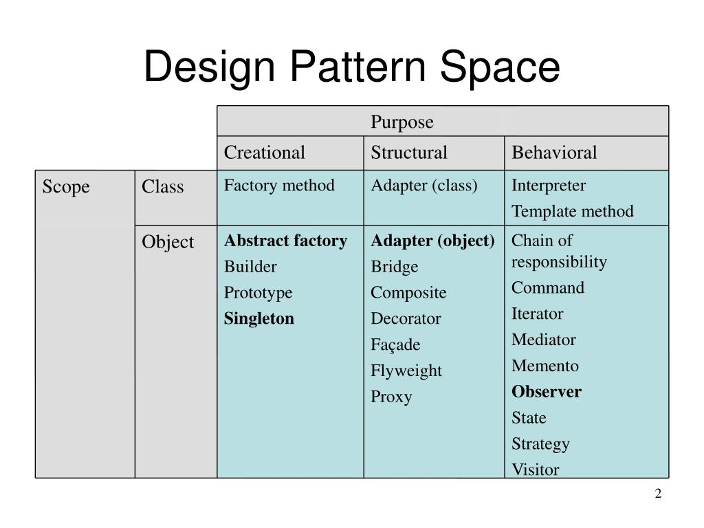

# 编程方法论

[TOC]

## 面向对象

### 四大特性

- **面向对象编程（Object Oriented Programming）**：一种编程范式，以类或对象作为组织代码的基本单元，并具有封装、抽象、继承、多态四个特性。

- **面向对象编程语言（Object Oriented Programming Language）**：语法机制支持表达类、对象、封装、继承、多态这些概念。

  >按照学院派的定义，现在很多语言（Javascript、Go）都不认为是面向对象语言。但我们不必非得下个死定义，这样做在工程上毫无意义。

- **面向对象分析（Object Oriented Analysis）**：通过对问题空间进行抽象来建立起对象模型。它解决要做什么的问题（What）。这个阶段是站在用户的视角下，不关心任何技术实现，只关心问题本身。该阶段的产物是用例图、简略的类图等等

- **面向对象设计（Object Oriented Design）**：在面向对象分析的基础上进一步细化和完善对象模型。它解决要怎么做的问题（How）。这个阶段是站在工程师的视角下，将 OOA 分析出的模型落地为可实现的方案。该阶段的产物是类图、时序图、接口设计等等

分析和设计两个阶段最终的产出是类的设计，包括有哪些类，每个类有哪些属性方法，类与类之间的关系以及如何进行交互等等。

面向对象编程的一个核心思想是：**用数据成员处理状态的变化，用多态处理行为的变化**。

### 与面向过程编程的区别和联系

>每种编程范式都有着自己擅长处理的问题领域。脱离实际问题背景去比较哪种编程范式更好，是毫无意义的。

对于大规模复杂程序的开发来说，整个程序的处理流程错综复杂，并非只有一条主线。如果把整个程序的处理流程画出来的话，会是一个网状结构。如果我们再用面向过程编程这种流程化、线性的思维方式去翻译这个网状结构，就会比较吃力。

这个时候，面向对象的编程风格的优势就比较明显了。在进行面向对象编程的时候，先去思考如何给业务建模，将需求翻译为类，然后按照流程给类之间建立交互关系，便自然而然地翻译出网状结构了。

汇编语言、面向过程编程语言的思维方式是偏硬件底层的。即如何设计一组指令来操作某些数据（算法为主、数据为辅）。而面向对象编程的思维方式是如何将真实的世界映射为类或者对象，这让我们更加聚焦到业务本身。

### 接口与抽象类

### 组合优于继承

组合的优势在于，它将行为从硬编码的一整套固定实现（继承），拆解为一组粒度更小的基本行为，这些基本行为可以在运行期自由搭配，组合出任意数量的复杂行为。

继承的缺陷如下：

- 组合爆炸：当对象的变化来自多个独立维度时，若用继承来表达所有组合，类的数量会呈乘法级增长。根因在于：继承是单维度的组织方式，而需求的变化是多维度的。

  下面来看一个例子：咖啡店有 4 种咖啡（浓缩、美式、拿铁、卡布奇诺），可选 4 种配料（牛奶、糖、巧克力、奶油）。若用继承表达：

  ```java
  class Coffee { double cost(); }
  class Espresso extends Coffee { ... }
  class EspressoWithMilk extends Espresso { ... }
  class EspressoWithMilkAndSugar extends EspressoWithMilk { ... }
  ...
  ```

  每种配料可选可不选，因此每种咖啡对应 2⁴ = 16 种配料组合，总共需要 4 × 16 = 64 个类。若再引入新需求——每种咖啡支持大、中、小三种份量——类数量进一步膨胀为 64 × 3 = 192 个类。

  ```
                Coffee
              /   |    \
        Espresso Latte Cappuccino ...     ← 维度一：咖啡种类
          /  \
     WithMilk WithSugar                   ← 维度二：配料
       /  \
   WithX   WithY                          ← 维度三：份量 ...
  ```

  使用组合 + 接口 + 委托技术可替代掉继承：

  ```java
  // 饮品基类 + 配料作为可组合的组件
  interface Beverage { double cost(); String desc(); }
  
  class Espresso implements Beverage {
      public double cost() { return 15; }
  }
  
  // 装饰器：配料"包裹"饮品，而不是继承它
  abstract class CondimentDecorator implements Beverage {
      protected Beverage beverage;   // 组合：持有一个饮品
  }
  
  class Milk extends CondimentDecorator {
      Milk(Beverage b) { this.beverage = b; }
      public double cost() { return beverage.cost() + 3; }  // 委托 + 加价
  }
  
  class Sugar extends CondimentDecorator {
      Sugar(Beverage b) { this.beverage = b; }
      public double cost() { return beverage.cost() + 1; }
  }
  ```

  使用时任意组合，无需新增类：

  ```java
  Beverage order = new Sugar(new Milk(new Milk(new Espresso())));
  // 浓缩 + 双份奶 + 糖，无需任何新类
  ```

  此时只需 4 个咖啡类 + 4 个配料类 = 8 个类，即可覆盖原先 64 个类表达的所有组合；类的数量是各维度线性相加。

- 可读性差：继承层次一旦加深，想弄清某个类究竟有哪些方法和属性，就必须沿着父类、父类的父类……一路追溯到最顶层父类的代码，阅读成本随深度线性增加。

- 脆弱基类：子类的实现依赖父类的实现，父类一旦修改，所有子类的行为都可能受影响 。

- 被拒绝的遗赠：子类强行覆写它不需要的方法，这通常意味着继承体系设计不合理——父类抽象粒度过粗，把并非所有子类共有的行为硬塞进了父类。实际开发中这类问题很常见。

现代软件工程理论认为，从最新的 Rust、Go 语言放弃继承这个概念就可以看出

### 充血模型

## 设计模式

**设计模式**是针对软件开发中经常遇到的一些设计问题总结出来的一套解决方案。要根据现有需求去应用设计模式，提前捕获需求往往会造成过度设计。建议在持续性重构过程中，再逐步应用其他的设计模式。**一劳永逸的设计是根本不存在的，因为不变的事物就是变化本身**。

设计模式的核心思想是，**将不变的事物与变化的事物隔离开来，向上暴露稳定的接口，向下承载着易变的实现**。



- 目的：

  | 类型                 | 目的                   | 关注点                                               |
  | :------------------- | :--------------------- | :--------------------------------------------------- |
  | 创建型（Creational） | 对象的创建过程         | 将对象的创建与使用分离                               |
  | 结构型（Structural） | 类或对象的组合方式     | 把类和对象组装成更大的结构，同时保持结构的灵活和高效 |
  | 行为型（Behavioral） | 对象间的职责分配与通信 | 描述对象之间如何交互、分配职责                       |

- 范围：

  - 类模式（Class Scope）：处理类和子类之间的关系，这些关系通过继承建立。关系在编译时就确定了，是静态的、固定的
  - 对象模式（Object Scope）：处理对象之间的关系，这些关系通过组合/聚合建立。关系在运行时才确定，是动态的、可变的

这个分类体现了 GoF 反复强调的两条核心原则：

1. 针对接口编程，而不是针对实现编程
2. 优先使用对象组合，而不是类继承（组合优于继承）

## 编码规范

**编程规范**主要解决的是代码的可读性问题。对于不同的编程规范来说，它们之间并没有优劣之分。在遵循团队的编程规范前提下，怎么舒服怎么用。

## 重构

> 实际上，优秀的代码都是重构出来的，复杂的代码都是慢慢堆砌出来的 。所以，当你看到那些优秀而复杂的开源代码时，不必自惭形秽。

只要软件在不停地迭代，就没有一劳永逸的设计。随着需求的变化，原有的设计必定会存在问题。针对这些问题，我们就需要进行代码重构。持续重构是保持代码质量不下降的有效手段，能有效避免代码腐化到无可救药的地步。

- 重构是什么（what）：重构是一种对软件内部结构的改善，目的是在不改变软件的可见行为的情况下，使其更易理解，修改成本更低。
- 为什么要重构（why）：重构是时刻保证代码质量处于一个可控状态的重要手段。
- 到底在重构什么（where）：根据重构的规模，我们可以分为：
  - 大规模高层次：对系统、模块、代码结构、类与类之间的关系等的重构。重构的手段有：分层、模块化、解耦、抽象可复用组件等等
  - 小规模低层次：对代码细节的重构，主要是针对类、函数、变量等代码级别的重构。编码规范就是小规模重构的手段。
- 什么时候重构（when）：集中重构解决所有问题是不现实的，我们**必须以可持续、可演进的方式来重构**。一定要建立持续重构意识，把重构作为开发必不可少的部分。
- 如何重构（how）：
  - 对于大型重构来说，涉及的模块、代码比较多。因此，在进行大型重构的时候，我们必须要提前做好完善的重构计划，分阶段来进行小范围的重构。重构后一定要进行测试，确保重构代码的正确性（**单元测试是保证重构正确性的必要手段**）。必要的时候还需要写一些兼容过渡代码。
  - 对于小型重构，只要你愿意，随时都可以去做。


