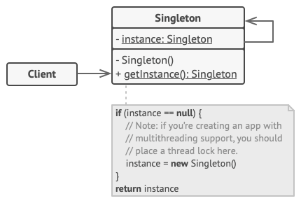
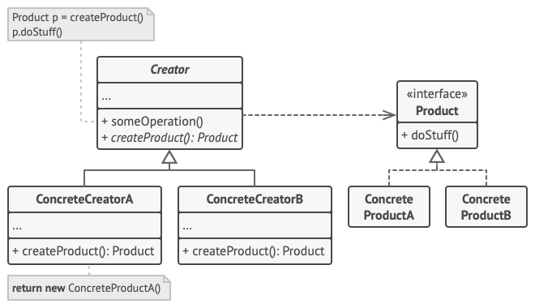
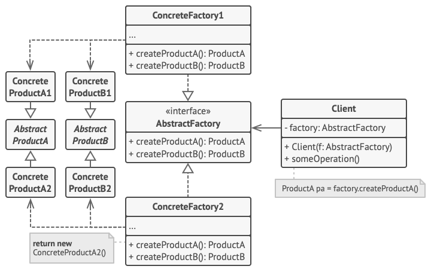
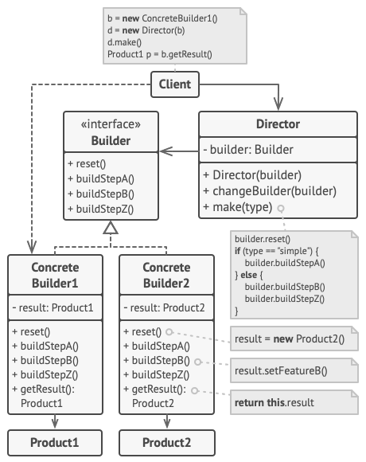
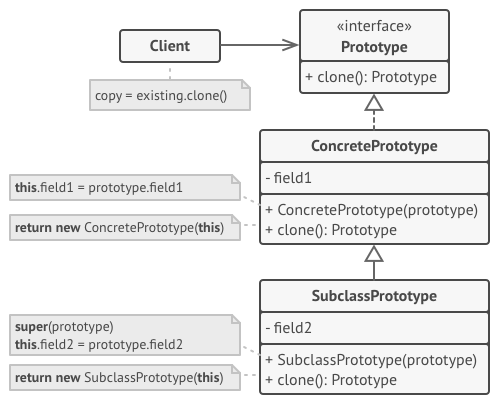

# 创建型

[TOC]

创建型模式将对象的创建过程抽象化：它们隐藏了实例如何被创建、由谁创建、何时创建的细节，使系统其他部分独立于对象的创建、组合与表示，从而让系统更灵活、更易扩展。

## 单例模式

确保一个类只有一个实例，并提供一个全局访问点来获取该实例。



### 饿汉式

```java
public class Singleton {
  // 类加载时即创建实例，JVM 保证线程安全
	private static final Singleton INSTANCE = new Singleton();
  
  // 私有构造，防止外部实例化
  private Singleton() {}
  
  // 全局访问点
  public static Singleton getInstance() {
    return INSTANCE;
  }
}
```

有一种观点认为，如果实例占用资源较多或初始化耗时较长，提前初始化会造成资源浪费。但笔者并不认同这种看法，因为按照 fail-fast 的设计原则，实例就应当在程序启动时完成加载，潜在问题及早暴露，避免在运行时因资源不足导致系统崩溃，影响系统可用性。唯一的例外是：当无法确定该实例是否会被系统使用时，延迟加载才是更合理的选择。

### 懒汉式

#### 同步方法懒汉式

```java
public class Singleton {
    private static Singleton instance;

    private Singleton() {
    }

    public static synchronized Singleton getInstance() {
        if (instance == null) {
            instance = new Singleton();
        }
        return instance;
    }
}
```

每次调用 `getInstance()` 都要先获取类锁。但实例的创建只会发生一次，真正需要加锁保护的也只有那一次；此后所有调用都只是读取已存在的实例，加锁纯属多余开销，高并发场景下性能差。

#### 双重检查锁 DCL

```java
public class Singleton {
    // volatile 禁止指令重排序，保证可见性
    private static volatile Singleton instance;

    private Singleton() {}

    public static Singleton getInstance() {
        if (instance == null) {                    // 第一次检查：避免不必要的加锁
            synchronized (Singleton.class) {
                if (instance == null) {            // 第二次检查：防止重复创建
                    instance = new Singleton();
                }
            }
        }
        return instance;
    }
}
```


这里详细说明为什么必须添加 `volatile`。问题的根源在于 `new` 操作不是原子的：

```java
instance = new Singleton();
```

这行代码编译后大致对应三条指令：

```C++
1. memory = allocate();   // 分配内存空间
2. initInstance(memory);  // 调用构造方法，初始化对象
3. instance = memory;     // 将引用指向该内存
```

JVM 出于性能优化的考虑，可能对步骤 2 和 3 进行重排序：

```java
1. memory = allocate();   // 分配内存空间
3. instance = memory;     // 先赋值引用（此时对象还没初始化！）
2. initInstance(memory);  // 后初始化
```

单线程环境下，这种重排序不会改变执行结果（JMM 保证单线程语义不变）；但在多线程环境下，问题就会暴露：

| 时序 | 线程 A                                   | 线程 B                       |
| :--- | :--------------------------------------- | :--------------------------- |
| 1    | 第一次检查：instance == null，进入同步块 |                              |
| 2    | 分配内存                                 |                              |
| 3    | 引用已赋值（重排序），但构造方法还没执行 |                              |
| 4    |                                          | 第一次检查：instance != null |
| 5    |                                          | 直接返回 instance 并使用     |
| 6    | 执行构造方法，完成初始化                 |                              |

`volatile` 通过两个机制解决该问题：

1. 禁止指令重排序：对 `volatile` 变量的写操作，JMM 保证其之前的所有操作都已完成（happens-before），即「初始化」一定发生在「引用赋值」之前，重排序被禁止。
2. 保证可见性：线程 A 对 `instance` 的写入对其他线程立即可见，线程 B 读到的一定是初始化完成后的引用

#### 静态内部类

```java
public class Singleton {
    private Singleton() {
    }

    private static class Holder {
        private static final Singleton INSTANCE = new Singleton();
    }

    public static Singleton getInstance() {
      // Holder 类只有在 getInstance() 首次被调用时才会加载，实现懒加载
      // 线程安全由 JVM 类加载机制保证，无需 synchronized 和 volatile，代码更简洁
        return Holder.INSTANCE;
    }
}
```

#### 枚举

如果需要防止反射攻击和序列化破坏单例，可以考虑用枚举实现

1. 反射攻击：可以通过反射的 `setAccessible(true)` 可以绕过访问检查，强行调用私有构造器创建新实例：

   ```java
   Constructor<Singleton> constructor = Singleton.class.getDeclaredConstructor();
   constructor.setAccessible(true);          // 绕过 private 限制
   Singleton s1 = constructor.newInstance(); // 创建出第二个实例！
   ```

2. 序列化：如果单例类实现了 `Serializable`，反序列化时会通过反射创建一个新对象，而不是返回已有实例：

   ```java
   byte[] bytes = serialize(Singleton.getInstance());
   Singleton s = deserialize(bytes);
   System.out.println(s == Singleton.getInstance()); // false，单例被破坏
   ```

   

枚举通过以下两种手段规避这些攻击：

1. 根据 `Constructor.newInstance()` 的源码，JDK 在反射创建对象时做了硬性检查：

   ```java
   // java.lang.reflect.Constructor#newInstance
   if ((clazz.getModifiers() & Modifier.ENUM) != 0)
       throw new IllegalArgumentException("Cannot reflectively create enum objects");
   ```

2. 枚举的序列化机制

   1. 序列化：只写入枚举常量的名字`name()`，不写入对象状态；
   2. 反序列化：从枚举类已有的常量表里查找，返回的必然是同一个实例，根本不会调用构造方法创建新对象


```java
public enum Singleton {
  	// 枚举常量的初始化由 JVM 类加载机制保证，天然线程安全的
    INSTANCE;

    public void doSomething() {
        // 业务方法
    }
}
```

### 带参单例

实现方式：

1. 参数不一致时显式报错

   ```java
   public class Singleton {
       private static Singleton instance = null;
       private final int paramA;
       private final int paramB;
   
       private Singleton(int paramA, int paramB) {
           this.paramA = paramA;
           this.paramB = paramB;
       }
   
       public synchronized static Singleton getInstance(int paramA, int paramB) {
           if (instance == null) {
               instance = new Singleton(paramA, paramB);
           } else if (instance.paramA != paramA || instance.paramB != paramB) {
               throw new IllegalArgumentException(
                   "Singleton already initialized with paramA=" + instance.paramA
                   + ", paramB=" + instance.paramB);
           }
           return instance;
       }
   }
   ```

2. 创建与获取分离（推荐）

   ```java
   public class Singleton {
       private static volatile Singleton instance = null;
       private final int paramA;
       private final int paramB;
   
       private Singleton(int paramA, int paramB) {
           this.paramA = paramA;
           this.paramB = paramB;
       }
   
       // 只允许调用一次，通常在程序启动时
       public synchronized static void init(int paramA, int paramB) {
           if (instance != null) {
               throw new IllegalStateException("Singleton already initialized");
           }
           instance = new Singleton(paramA, paramB);
       }
   
       public static Singleton getInstance() {
           if (instance == null) {
               throw new IllegalStateException("Singleton not initialized, call init() first");
           }
           return instance;
       }
   }
   ```

3. 通过配置获取参数

   ```java
   public static Singleton getInstance() {
       if (instance == null) {
           synchronized (Singleton.class) {
               if (instance == null) {
                   Config config = Config.load(); // 从配置文件、环境变量等读取
                   instance = new Singleton(config.getParamA(), config.getParamB());
               }
           }
       }
       return instance;
   }
   ```

4. 如果不同的调用方可能传不同的参数，往往说明这个类本质上不应该是单例。

### 局限

单例模式最大的问题就是会隐藏类之间的依赖关系。当我们阅读代码时，通过构造函数、参数转递等方式可以一眼识别出类之间的依赖关系。而单例模式则是在方法内部直接调用 `getInstance()` 获取实例，只有深入阅读代码实现，才能发现这个类究竟依赖了哪些单例类。这使得类的依赖关系变得隐晦，增加了代码理解和维护的成本。


其次，单例模式对 OOP 特性的支持不够友好，它违背了「基于接口而非实现编程」的设计原则。来看下面这个例子：

```java
public class Order {
  public void create(...) {
    //...
		// 注意 getInstance() 是静态方法，无法抽象出一个接口。
    long id = IdGenerator.getInstance().getId();
    //...
  }
}

public class User {
  public void create(...) {
    // ...
    long id = IdGenerator.getInstance().getId();
    //...
  }
}
```

在上述代码中，`Order` 和 `User` 直接依赖了 `IdGenerator` 这个具体实现类，而非抽象接口。一旦业务需求变更，需要为不同的业务使用不同的 ID 生成器，我们就不得不逐一修改所有用到 `IdGenerator` 的地方。这种散落于各处的改动不仅工作量大，还很容易因遗漏而引入 bug：

```java
public class Order {
  public void create(...) {
    //...
    // long id = IdGenerator.getInstance().getId();
    long id = OrderIdGenerator.getInstance().getId();
    //...
  }
}

public class User {
  public void create(...) {
    // ...
    // long id = IdGenerator.getInstance().getId();
    long id = UserIdGenerator.getInstance().getId();
  }
}
```

## 多例模式

多例模式（Multiton Pattern）是单例模式的扩展：一个类可以创建有限数量的实例，每个实例对应一个固定的「键」，相同的键永远返回同一个实例。

```java
// 饿汉实现
public class IdGenerator {
    public enum Type { ORDER, USER, PRODUCT }

  	// 实例缓存：key -> 实例
    private static final Map<Type, IdGenerator> INSTANCES = new EnumMap<>(Type.class);

    static {
        for (Type type : Type.values()) {
            INSTANCES.put(type, new IdGenerator(type));
        }
    }

    private final Type type;

    private IdGenerator(Type type) {
        this.type = type;
    }

  	// 相同的 key 返回同一个实例
    public static IdGenerator getInstance(Type type) {
        return INSTANCES.get(type);
    }
}
```

## 工厂模式

工厂模式本质上就是封装了这样一个创建逻辑——根据分类方式有选择地创建不同类型的、但又相似的对象。这样就解耦了对象的创建和使用。

### 简单工厂（Simple Factory）

将创建逻辑集中封装到一个工厂类中，通过 `if-else`/`switch` 根据参数决定创建哪种对象。下面给出一个例子：

```java
public class RuleConfigParserFactory {
    public static IRuleConfigParser createParser(String configFormat) {
        IRuleConfigParser parser = null;
        if ("json".equalsIgnoreCase(configFormat)) {
            parser = new JsonRuleConfigParser();
        } else if ("xml".equalsIgnoreCase(configFormat)) {
            parser = new XmlRuleConfigParser();
        } else if ("yaml".equalsIgnoreCase(configFormat)) {
            parser = new YamlRuleConfigParser();
        }
        return parser;
    }
}
```

### 工厂方法（Factory Method）

简单工厂违反了开闭原则：每新增一种对象类型，都要修改工厂中的创建方法。工厂方法通过多态解决了这个问题——新增类型只需添加新的工厂类，无需改动已有代码，但代价是类数量增多，代码结构更分散，可读性有所下降。

在 GoF 中的定义如下：定义一个用于创建对象的接口，让子类决定实例化哪一个类。工厂方法使一个类的实例化延迟到其子类。




### 抽象工厂（Abstract Factory）

提供一个接口，用于创建在概念上具有相关性的对象簇。应用的例子：

- 跨平台 UI 组件库：一套应用要同时支持 Windows / macOS / Linux，每个平台的按钮、文本框、滚动条风格必须配套一致。如果用工厂方法，客户端可能混用 `WinButton` + `MacTextBox`，风格错乱；抽象工厂保证「同一产品簇要么全用，要么全不用」这一约束。
- 支付系统：对接支付宝/微信/银联，每家渠道有配套的下单、退款、对账接口实现。




- AbstractFactory：提供多个创建不同产品的方法，这些产品在概念上具有相关性
- AbstractProduct：每种产品的抽象接口
- ConcreteFactory：AbstractFactory 的具体实现，负责创建同一产品簇下的各个产品。
- ConcreteProduct：AbstractProduct 的具体实现，由对应的 ConcreteFactory 创建
- Client：只与 AbstractFactory 以及 AbstractProduct 交互，对于具体的实现 ConcreteFactory、ConcreteProduct 不关心。


下面给出 GUI 组件库的伪代码实现：

```java
// AbstractFactory
interface GUIFactory {
  Button createButton();
  Checkbox createCheckbox();
}

// ConcreteFactory
class WinFactory implements GUIFactory {
  public Button createButton() {
    return new WinButton();
  }
  
  public Checkbox createCheckbox() {
    return new WinCheckbox();
  }
}

// ConcreteFactory
class MacFactory implements GUIFactory {
  public Button createButton() {
    return new MacButton();
  }
  
  public Checkbox createCheckbox() {
    return new MacCheckbox();
  }
}
```

```java
// AbstractProduct
interface Button {
  void paint();
}

// ConcreteProduct
class WinButton implements Button {
  void paint() {}
}

// ConcreteProduct
class MacButton implements Button {
  void paint() {}
}
```

```java
// Client
class Application {
  private GUIFactory factory;
  
  // 外部通过配置决定将 WinFactory 或者 MacFactory 注入
  public Application(GUIFactory factory) {
    this.factory = factory;
  }
  
  public static void main(String[] args) {
    Button button = factory.createButton();
    button.paint();
  }
}
```


## 建造者模式

将一个复杂对象的构建过程与它的表示分离，使得同样的构建过程可以创建不同的表示。



## 原型模式

使用一个原型实例作为模板，并通过复制该原型来创建新对象。


