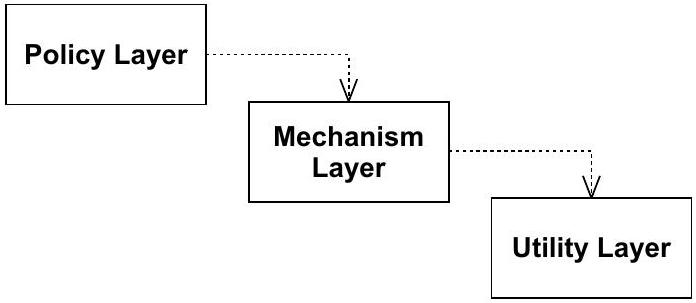
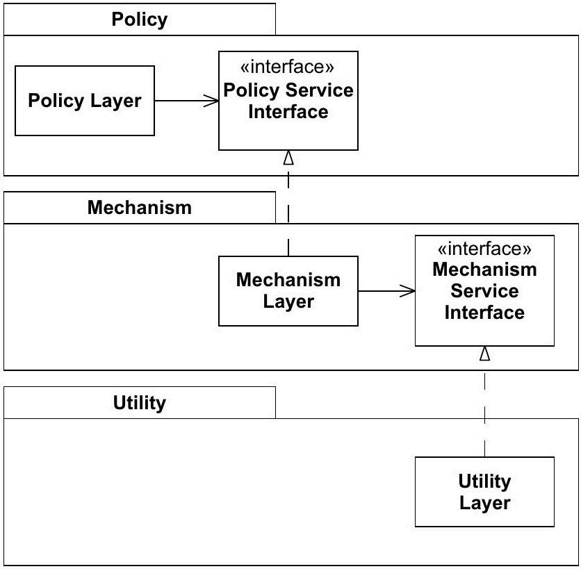

# 设计原则

[TOC]

设计原则（道）指导着设计模式（术）

## 单一职责原则

Single Responsibility Principle：A class should have only one reason to change.


如果一个类承担了不止一个职责（要做什么 What），那么这些职责就会彼此耦合。如果此时对其中某个职责的修改，可能会削弱甚至妨碍这个类去履行其他职责的能力，那么这种耦合会使设计变得脆弱：一旦发生变化，系统就可能以意想不到的方式被破坏。

注意 SRP 原则关注的是变化原因，而不是职责的数量。也就是说，如果需求变更不会导致两个职责在不同时间发生变化，那么就没必要将它们分离开来。事实上，如果强制分离它们，代码就会散发「不必复杂性」的坏味道。

违反单一职责原则的另一种表现是：同一项职责被分散到多个类中，导致一次需求变化需要在许多类里同步修改，形成霰弹式修改。

## 开闭原则

Open/Closed Principle：software entities (modules, classes, functions, etc.) should be open for extension , but closed for modification


当程序中的某处修改引发依赖模块发生连锁改动时，这个设计就散发出僵化的味道。如果很好地应用了开闭原则，那么仅需添加新代码，而无需修改那些已经正常运行的旧代码，变化被隔离在新代码中，避免修改引入的风险。

符合开闭原则的模块具有两个主要属性：

- 对扩展开放：当应用需求发生变化时，我们可以通过为模块增加新的行为来满足这些变化；换句话说，能够在不改动原有实现的前提下，改变模块「能做什么」
- 对修改关闭：扩展模块的行为不会导致模块的源代码或二进制代码发生改变。

实现开闭原则的关键就是抽象，通过定义派生类来扩展模块的行为。

通常来说，无论一个模块多么封闭，总存在某种它无法封闭的变更，因此 OCP 的使用必须有战略性。程序员必须推测最有可能发生的变更，然后构建 OCP 抽象以保护自己免受这些变更的影响。在实际开发中，建议以持续性重构的方式识别出真正需要 OCP 的地方，别为想象中的变更提前付复杂度税。

## 里式替换原则

Liskov Substitution Principle：Functions that use pointers of references to base classes must be able to use objects of derived classes without knowing it


子类在设计的时候，要严格遵守父类的行为契约，例如函数声明要实现的功能、对输入、输出、异常的约束等等。

假设我们有一个函数 f，它接受一个指向基类 B 的指针作为参数。再假设存在 B 的派生类 D，当它以 B 的形式传递给 f 时，会导致 f 行为异常。那么，D 就违反了里氏替换原则。

然而 f 的作者可能会加入某种针对 D 的特殊处理，以便 D 被传递给它时，f 能够正常运行。这种测试违反了开闭原则（OCP），因为现在 f 并未对 B 的各种派生类关闭。此类处理是一种代码坏味道，源于经验不足的开发者（或者更糟糕的是，匆忙行事的开发者）对 LSP 违例做出的补救措施。 并且违反了依赖倒置原则， f 依赖了具体子类 B 而非稳定抽象 D

```c++
//A violation of LSP causing a violation of OCP.
struct Point {double x,y;};

struct Shape {
	enum ShapeType {square, circle} itsType;
	Shape(ShapeType t) : itsType(t) {}
};

struct Circle : public Shape
{
	Circle() : Shape(circle) {};
	void Draw() const;
};

struct Square : public Shape
{
    Square() : Shape(square) {};
    void Draw() const;
};

void DrawShape(const Shape& s)
{
    // DrawShape 函数违反了 OCP。它必须了解 Shape 类的每一个可能的派生类，并且每当创建新的 Shape 派生类时，都必须对其进行修改。Bad Code
    if (s.itsType == Shape::square)
        static_cast<const Square&>(s).Draw();
    else if (s.itsType == Shape::circle)
        static_cast<const Circle&>(s).Draw();
}
```


如果发现某个子类的行为违背了里氏替换原则（LSP），说明该子类并不适合作为当前继承体系的一员。此时可以考虑两条重构手段：

1. 放弃继承关系，转而使用组合复用原有能力
2. 从现有继承体系中抽离出一个更通用的基类或中间层，让子类与原有类平级继承，从而消除 is-a 关系被错误建模的问题（不推荐）。

## 接口隔离原则

Interface-Segregation Principle：Clients should not be forced to depend upon interfaces that they do not use


此原则针对胖接口的弊端。具有胖接口的类，其接口缺乏内聚性。胖接口的客户端被迫依赖自己不使用的方法，导致所有客户端无意之间耦合在一起。当一个客户端迫使臃肿的类发生变更时，所有其他客户端都会受到影响。我们可以类的接口可以拆分为若干方法组，每组服务于不同的客户端集合来解决该弊端。

系统中必然会存在非内聚接口的对象，例如

```java
// 一个功能齐全的"万能"数据库操作类
class UniversalDb {
    void insert(...);        // 增
    void delete(...);        // 删
    void query(...);         // 查
    void exportToExcel(...); // 报表导出
    void backup(...);        // 备份
    void migrate(...);       // 数据迁移
}
```

此时，我们按照 ISP，将胖类的接口按内聚性拆成多个抽象基类/接口，客户端只依赖与自己相关的那一个

```java
// 拆成多个内聚的抽象，但都指向同一个具体实现
interface CrudRepository { 
    void insert(...); 
    void delete(...); 
    void query(...); 
}

interface ReportExporter { 
    void exportToExcel(...); 
}

interface DbAdmin { 
    void backup(...); 
    void migrate(...); 
}

class UniversalDb implements CrudRepository, ReportExporter, DbAdmin { ... }
```

```java
// 订单服务只做 CRUD → 只看得见这三个方法
class OrderService {
    OrderService(CrudRepository db) { ... }
}

// 报表服务只做导出 → 对 insert/delete 完全无感知
class ReportService {
    ReportService(ReportExporter db) { ... }
}
```

虽然底层上还是同一个 `UniversalDb` 对象，但每个客户端只通过窄接口认识它。


## 依赖倒置原则

Dependency Inversion Principle：

1. High-level modules shouldn’t depend on low-level modules. Both modules should depend on abstractions

   传统设计方式采用自顶向下的原则， 逐层依赖，底层修改会沿依赖链波及高层，牵一发而动全身。

   引入抽象层后，模块间解耦。当底层实现发生改变时，高层代码完全不需要修改。这样做的前提是抽象层足够稳定，该手段仅仅是把耦合从代码层面转移到了接口层面，将变化隔离在抽象中。

   有种例外情况，如果底层模块足够稳定，那么高层模块可以直接依赖该底层。

   | 直接依赖                                                     | 依赖倒置                                                     |
   | ------------------------------------------------------------ | ------------------------------------------------------------ |
   |  |  |

2. In addition, abstractions shouldn’t depend on details. Details depend on abstractions.

   不要基于那些本应被抽象掉的细节来构建你的抽象。下面来看一个例子：

   ```java
    // ❌ 接口设计依赖 Kafka 中的概念（具体细节）
   interface MessageSender {
       void send(String topic, int partition, byte[] payload);
       void initKafkaConfig(Map<String, Object> kafkaProps);
   }
   ```

   ```java
   // ✅ 抽象只说"做什么"，用业务词汇，不出现任何中间件概念
   interface MessageSender {
       void send(Message message);
   }
   
   // 细节（具体实现）来适配抽象
   class KafkaSender implements MessageSender {
       public void send(Message msg) {
           // topic、分区等 Kafka 概念只存在于这里，不上渗到接口
       }
   }
   ```


## DRY 原则、KISS 原则、YAGNI 原则、LOD 法则

### KISS 原则

KISS 原则：Keep It Simple and Stupid.

KISS 原则就是保持代码可读和可维护的重要手段。注意，简单 ≠ 简陋、简单 ≠ 容易、简单 = 本质。下面我们来看几个反例：

1. 炫技式写法

   ```python
   # ❌ 一行流，只有写的人看得懂
   result = [f(x) for x in data if g(x) and not h(x)]
   
   # ✅ 拆成有名字的步骤，意图自明
   filtered = [x for x in data if is_valid(x)]
   processed = [transform(x) for x in filtered]
   ```

2. 过度抽象

   ```java
   // ❌ 三层继承 + 接口隔离 + 模板方法，只为处理两种略有不同的数据格式
   // ✅ if-else 或 switch 在分支有限时，往往比抽象层次更清晰
   ```

3. 过早优化

   ```java
   // ❌ 一上来就考虑百万并发，引入线程池、对象池、缓存层
   // ✅ 先写能工作的同步代码，性能瓶颈出现时再用 profiler 找真热点
   ```

### DRY 原则

Don’t Repeat Yourself

它的核心不是字面上的「不要复制粘贴代码」，而是更严格的：每一个知识（业务逻辑、决策、规则、数据定义）在系统中都应该有且仅有一个明确的、权威的表达来源。

下面来看个反例：两段代码变量名不同、调用的 getter 不同，但邮箱校验规则这份知识被重复了。如果校验规则发生了变化，那么你需要同时找到并修改所有散落在各处的校验逻辑——散弹式修改

```java
// 用户注册校验
public void validateRegistration(User user) {
    String email = user.getEmail();
    if (email == null || !email.matches("^[A-Za-z0-9+_.-]+@(.+)$")) {
        throw new InvalidEmailException();
    }
}

// 修改邮箱校验
public void validateEmailUpdate(User user) {
    String mail = user.getContact().getEmailAddress();
    if (mail == null || !mail.matches("^[A-Za-z0-9+_.-]+@(.+)$")) {
        throw new InvalidEmailException();
    }
}
```

```java
// 把知识本身提取出来
public class EmailValidator {
    private static final Pattern PATTERN = Pattern.compile("^[A-Za-z0-9+_.-]+@(.+)$");
    
    public static boolean isValid(String email) {
        return email != null && PATTERN.matcher(email).matches();
    }
}

// 注册和修改邮箱统一调用
EmailValidator.isValid(user.getEmail());
EmailValidator.isValid(user.getContact().getEmailAddress());
```


DRY 不是教条。如果两段代码现在碰巧一样，但变化原因不同，强行合并反而有害。正如 Sandi Metz 所说：「重复的代码比错误的抽象要便宜得多」

```java
public class UserAuthenticator {
  public void authenticate(String username, String password) {
    if (!isValidUsername(username)) {
      // ...throw InvalidUsernameException...
    }
    if (!isValidPassword(password)) {
      // ...throw InvalidPasswordException...
    }
    //...省略其他代码...
  }

  private boolean isValidUsername(String username) {
    // check not null, not empty
    if (StringUtils.isBlank(username)) {
      return false;
    }
    // check length: 4~64
    int length = username.length();
    if (length < 4 || length > 64) {
      return false;
    }
    // contains only lowcase characters
    if (!StringUtils.isAllLowerCase(username)) {
      return false;
    }
  }

  private boolean isValidPassword(String password) {
    // check not null, not empty
    if (StringUtils.isBlank(password)) {
      return false;
    }
    // check length: 4~64
    int length = password.length();
    if (length < 4 || length > 64) {
      return false;
    }
    // contains only lowcase characters
    if (!StringUtils.isAllLowerCase(password)) {
      return false;
    }
  }
}
```

在上述代码中，虽然校验用户名以及密码的逻辑是相同的，但是它们功能语义不同，也就是变化原因不同。此时我们无需抽取公共逻辑，这并不违反 DRY。

### YAGNI 原则

不要去设计当前用不到的功能，即不要做过度设计。它是极限编程（XP）的核心原则之一，即除非当前迭代有明确需求，否则不要在业务代码中实现任何功能、抽象或扩展点。

>YAGNI 原则跟 KISS 原则并非一回事儿。KISS 原则讲的是“如何做”的问题（尽量保持简单），而 YAGNI 原则说的是“要不要做”的问题（当前不需要的就不要做）。

### 最少知识原则

一个软件实体（如类、模块、对象）应当尽可能少地与其他实体发生相互作用，对其他对象的内部细节有尽可能少的了解。

下面来看个例子：

```java
// ❌ 违反：深入领域对象内部
class Wallet {
    private float money;
    public float getMoney() { return money; }
    public void withdraw(float amount) { this.money -= amount; }
}

class Customer {
    private Wallet wallet;
    public Wallet getWallet() { return wallet; }  // 把内部钱包暴露出去
}

class Waiter {
    public void collectMoney(Customer customer, float amount) {
        // 服务员不仅知道顾客有钱包，还深入钱包内部取钱
        Wallet wallet = customer.getWallet();
        if (wallet.getMoney() >= amount) {
            wallet.withdraw(amount);
        }
    }
}
```

```java
// ✅ 遵循：由聚合根/实体自己回答
class Customer {
    private Wallet wallet;
    // 封装内部细节，对外只暴露"意图"
    public float pay(float amount) {
        if (wallet.getMoney() >= amount) {
            wallet.withdraw(amount);
            return amount;
        }
        return 0f; // 或抛出异常
    }
}

class Waiter {
    public void collectMoney(Customer customer, float amount) {
        // 服务员只认识顾客，只向顾客发请求："付钱"
        // 顾客怎么付、用钱包还是手机，服务员完全不关心
        float paid = customer.pay(amount);
    }
}
```

