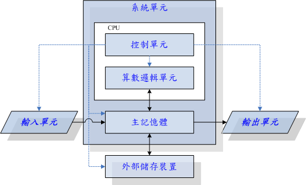
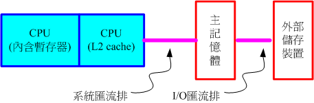
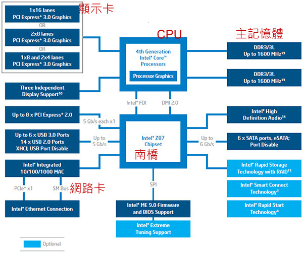
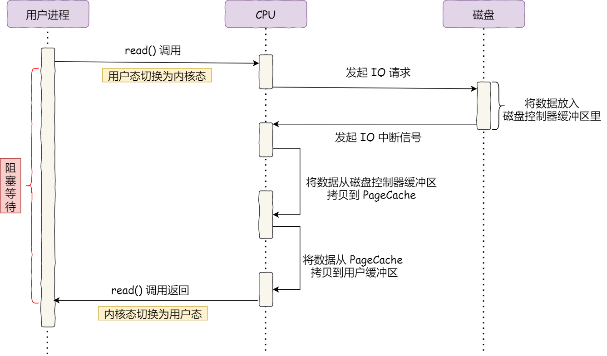
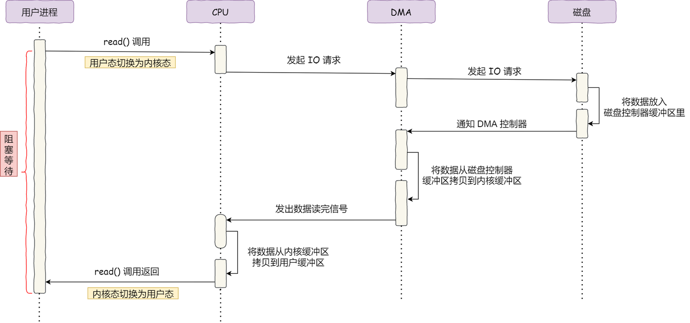
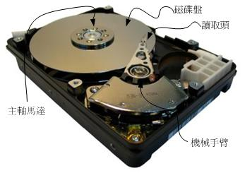
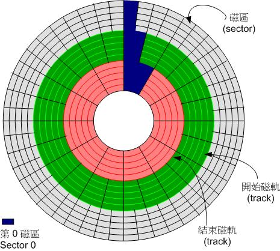

## 硬件概览

- 输入单元：负责将外部信息转换为计算机可识别的电信号：

  - 人机交互设备：键盘、鼠标、触控板/触控屏幕
  - 数据采集设备：扫描仪、读卡机、手写板、麦克风、摄像头
  - 传感器类：温度传感器、运动传感器等

- 系统单元：

  - CPU 是计算机的运算和控制核心

    - 算术逻辑单元：负责程序运算与逻辑判断
    - 控制单元：协调各单元间的工作

    >指令集架构（ISA）：CPU 设计的基础规范，主要分为两类：
    >
    >- **RISC（精简指令集）**：指令简单、执行周期固定，代表有 **ARM**（广泛应用于手机、嵌入式设备、路由器等）
    >- **CISC（复杂指令集）**：指令丰富、功能强大，代表有 **Intel x86、AMD x86-64**（主要应用于 PC 和服务器）

  - 主内存（RAM）：用于临时存放正在运行的程序和正在被处理的数据。

  - 主板：主机内各硬件通过主板上的总线（Bus）和插槽连接在一起。主板上的控制芯片组，负责协调 CPU、内存、存储设备、外设之间的数据通信。

  - 存储设备

- 输出单元：将计算机处理结果以人类可感知的形式呈现。例如，显示器、投影仪、音响、打印机、振动马达

### 单位

| 进制   | 千   | 兆    | 吉    | 太    | 拍    | 艾    | 泽    |
| ------ | ---- | ----- | ----- | ----- | ----- | ----- | ----- |
| 二进制 | 1024 | 1024K | 1024M | 1024G | 1024T | 1024P | 1024E |
| 十进制 | 1000 | 1000K | 1000M | 1000G | 1000T | 1000P | 1000E |

- 容量单位以二进制表示，例如文件大小、内存大小

  >硬盘厂商采用十进制计量标准，因此标称 500GB 的硬盘，换算为系统识别的二进制文件容量后，实际可用容量约 466GB。

- 速度单位以十进制表示，例如 CPU 频率、网络传输速度、硬盘读写速度

### CPU

- CPU 主频：CPU 内核工作的时钟频率。
- CPU 外频：在早期架构中，前端总线 FSB（Front Side Bus）作为 CPU 与北桥芯片的通信总线，负责处理器与北桥芯片间的数据传输。因此所谓的外频指的是 CPU 和外部组件传输数据的基准频率。现代 CPU 已将北桥功能集成至处理器内部，CPU 可直接与内存交互，无需再考虑外频
- CPU 倍频：主频与外频的倍率
- 超频：通过主板配置调高 CPU 倍频或外频，以提升 CPU 主频
- 字长：CPU 单次运算可处理的数据位数
- 超线程：单个物理 CPU 核心可虚拟出两个逻辑核心。其核心原理是在每个 CPU 内设置多组独立寄存器，每组寄存器供不同线程使用。某一线程指令阻塞时，CPU 可切换执行另一线程指令，充分利用硬件资源。

### 内存

RAM 可以分为 

- DRAM（动态随机存取存储器）：用电容存数据，需要持续刷新，成本低、容量大，常做电脑主存。
- SRAM（静态随机存取存储器）：用触发器存数据，不用刷新，速度极快但成本高、容量小，常做CPU高速缓存

DRAM 技术：

| SDRAM/DDR | 型号      | 数据宽度（位） | 内部时钟频率（MHz） | 频率速度 | 带宽（频率 x 宽度） |
| --------- | --------- | -------------- | ------------------- | -------- | ------------------- |
| SDRAM     | PC100     | 64             | 100                 | 100      | 800MBytes/sec       |
| SDRAM     | PC133     | 64             | 133                 | 133      | 1064MBytes/sec      |
| DDR       | DDR-266   | 64             | 133                 | 266      | 2.1GBytes/秒        |
| DDR       | DDR-400   | 64             | 200                 | 400      | 3.2GBytes/秒        |
| DDR       | DDR2-800  | 64             | 200                 | 800      | 6.4GBytes/秒        |
| DDR       | DDR3-1600 | 64             | 200                 | 1600     | 12.8GBytes/秒       |

DDR 是指双倍数据传送速度（Double Data Rate），它可以在一个工作周期内进行两次数据传输，与 CPU 倍频概念相似。其中，DDR2 的频率倍数为 4 倍，而 DDR3 则为 8 倍。

此外，某些主板还支持 DRAM 双通道功能，即两根主内存整合在一起。若单根内存的数据宽度可达 64 位，两根内存的即可达到 128 位，从而提升带宽。当启动双通道功能时，必须将两根容量相同的主内存插入主板中相同颜色的插槽里。

### 主板

由于外设访问速度的差异，早期的主板芯片组通常分为两个桥接器来控制各组件间的通信：

- 北桥（传统架构）：负责高速设备（CPU、内存、显卡）
- 南桥：负责低速 I/O 设备（USB、SATA、音频等）

现代 CPU 已将北桥功能集成到芯片内部。

>注意，由受到于 CPU 引脚以及内存插槽规格、工作电压的限制，同主板支持的 CPU 和内存型号存在差异

#### 设备 I/O 地址

IO 地址（输入/输出地址，Input/Output Address）是计算机CPU用来与硬盘、键盘、网卡等外部设备进行通信的专用地址。通过这些地址，CPU可以向设备发送指令或读取数据。有两种编址方式：

- 统一编址 （存储器映射方式, MMIO）：外设的I/O寄存器与主存单元共用同一个地址空间。不需要专门的I/O指令，直接使用访存指令（如 `MOV`、`ADD` 等）对设备读写。
- 独立编址（I/O映射方式, I/O Port）：主存地址空间和I/O地址空间是完全独立的两套系统。必须使用专用的I/O指令（如x86的 `IN` 和 `OUT`）来读写外设。

IRQ（Interrupt Request，中断请求）是硬件设备通知中央处理器（CPU）处理紧急任务的一种信号机制。当外设（如键盘、网卡、硬盘）有数据需要处理时，会向 CPU 发送 IRQ 中断。CPU 暂停当前任务并保存状态，运行中断服务程序。处理完成后，回到原本的任务继续执行。

#### DMA

在没有 DMA 技术之前，所有内存与外设之间的数据传输都必须由 CPU 亲自搬运，即逐个字节地把数据从外设读入寄存器，然后再写入内存，导致 CPU 被严重占用。

DMA（直接内存访问）：在 I/O 设备与内存进行数据传输时，CPU 只需初始化 DMA 控制器（设定源地址、目标地址和传输长度），后续的实际数据搬运工作由 DMA 控制器独立完成。传输期间 CPU 可执行其他任务，传输完成后 DMA 向 CPU 发送中断信号通知其进行后续处理。

#### CMOS 与 BIOS

- 固件（firmware）：烧录在硬件里的程序，负责控制硬件的最底层基本功能
- BIOS：全称基本输入输出系统，控制电脑开机自检、硬件初始化以及加载引导程序等等，也是一种固件。电脑按下开机键后，CPU 通电并重置，程序计数器被硬件强制设置为一个固定的初始地址（x86 架构下通常为 0xFFFFFFF0），该地址映射到主板上的 ROM/Flash 芯片，CPU 从此处开始执行 BIOS 固件代码。
- CMOS：存储 BIOS 程序的配置参数（例如，CPU 电压与频率、各项设备的 I/O 地址与 IRQ 等）的 RAM 芯片。依靠主板纽扣电池维持数据，断电后，CMOS 参数全部恢复出厂默认值。
- ROM：只读存储器，现在多指可擦写的闪存芯片，用来长期保存固件代码和数据。

### 显卡

PCI 插槽技术

| 规格         | 宽度    | 速度     | 带宽          |
| ------------ | ------- | -------- | ------------- |
| PCI          | 32 bits | 33 MHz   | 133 MBytes/s  |
| PCI 2.2      | 64 位   | 66 MHz   | 533 MBytes/s  |
| PCI-X        | 64 位   | 133 MHz  | 1064 MBytes/s |
| AGP 4x       | 32 位   | 66x4 MHz | 1066 MBytes/s |
| AGP 8x       | 32 位   | 66x8 MHz | 2133 MBytes/s |
| PCIe 1.0 x1  | 无      | 无       | 250 MB/s      |
| PCIe 1.0 x8  | 无      | 无       | 2 GB/s        |
| PCIe 1.0 x16 | 无      | 无       | 4 GB/s        |

比较特殊的是，PCIe（PCI-Express）采用点对点串行通道（Lane）的设计。在 PCIe 1.0 中，每条 Lane 单向带宽为 250 MB/s；通道数越多（如 x1、x4、x8、x16），总带宽就越高。

| 规格     | 1x 带宽    | 16x 带宽   |
| -------- | ---------- | ---------- |
| PCIe 1.0 | 250MByte/s | 4GByte/s   |
| PCIe 2.0 | 500MByte/s | 8GByte/s   |
| PCIe 3.0 | ~1GByte/s  | ~16GByte/s |
| PCIe 4.0 | ~2GByte/s  | ~32GByte/s |

### 硬盘

硬盘磁盘盘片、机械臂、磁头读写装置以及主轴马达所组成的。在实际运作时，主轴马达带动磁盘盘片旋转，随后机械臂伸展，使读取头在盘片上执行读写动作。

扇区（sector）是磁盘最小的物理存储单元。位于同一同心圆上的若干扇区构成磁道（track）；所有盘片上半径相同的磁道共同组成柱面（cylinder）。

## 操作系统

操作系统的作用：

1. 以高效合理的方式组织与管理计算机各类资源
   1. 硬件资源：`CPU`、内存、设备（`I/O`设备、磁盘、时钟、网络卡等）
   2. 软件资源：磁盘上的文件、各类管理信息等
2. 为用户提供了一组功能强大、方便易用的命令或系统调用。例如，进程的创建与执行、文件和目录的操作等等。在应用程序和硬件之间构建抽象的扩展机器（虚拟机），对硬件进行封装抽象，提升软件可移植性。

操作系统划两种运行级别。

- **用户态**：权限较低，供普通应用程序运行，不能直接操作硬件
- **内核态**：拥有最高权限，可以控制所有硬件与系统资源。用户态的应用程序可以通过三种方式来访问内核态的资源：系统调用、库函数以及 Shell 脚本。

>我们可以通过虚拟机开展 Linux 学习，VM 相关资料详见：
>
>- [VirtualBox 官网 (https://www.virtualbox.org)](https://www.virtualbox.org/)
>- [VirtualBox 官方教程（https://www.virtualbox.org/manual/ch01.html）](https://www.virtualbox.org/manual/ch01.html)

## 磁盘分割

 Linux 系统中，**一切皆文件**（Everything is a file）是核心设计哲学之一，硬件设备也不例外。系统通过 `/dev` 目录下的特殊文件来抽象和访问硬件。下表列出了常见设备类型及其对应的设备文件名：

| 设备类型                   | 设备文件名                     | 备注                                                     |
| :------------------------- | :----------------------------- | :------------------------------------------------------- |
| **SCSI/SATA/USB 硬盘**     | `/dev/sd[a-p]`                 | 现代系统最常见的块设备命名方式                           |
| **USB 闪存盘**             | `/dev/sd[a-p]`                 | 与 SATA 硬盘共用同一命名规则，依插入顺序分配             |
| **VirtIO 虚拟磁盘**        | `/dev/vd[a-p]`                 | 用于 KVM/QEMU 等虚拟机环境                               |
| **NVMe 固态硬盘**          | `/dev/nvme[0-9]n[1-9]`         | 如 `/dev/nvme0n1`，现代高性能 SSD 的标准命名             |
| **CD/DVD 光驱**            | `/dev/sr[0-1]` 或 `/dev/cdrom` | `sr` 为 SCSI 命名，`cdrom` 通常是指向实际设备的软链接    |
| **鼠标**                   | `/dev/input/mouse[0-15]`       | 通用输入层设备文件；`/dev/mouse` 为当前鼠标软链接        |
| **打印机**                 | `/dev/usb/lp[0-15]`            | USB 接口打印机；传统并口打印机 `/dev/lp[0-2]` 已极为罕见 |
| **终端/控制台**            | `/dev/tty[0-63]`               | 虚拟控制台；`/dev/ttyS[0-3]` 为串口终端                  |
| **随机数设备**             | `/dev/random`、`/dev/urandom`  | 提供内核熵池生成的随机数据                               |
| **零设备/空设备**          | `/dev/zero`、`/dev/null`       | 常用于数据丢弃或生成空数据流                             |
| **IDE 硬盘（ legacy ）**   | `/dev/hd[a-d]`                 | 仅存在于旧版内核或极老的系统中，现已淘汰                 |
| **软盘驱动器（ legacy ）** | `/dev/fd[0-1]`                 | 已基本退出历史舞台                                       |
| **磁带机（ legacy ）**     | `/dev/st0`、`/dev/ht0`         | SCSI/IDE 接口磁带机，企业备份场景偶见                    |

>更多信息请参考：https://www.kernel.org/doc/html/v4.20/admin-guide/devices.html
